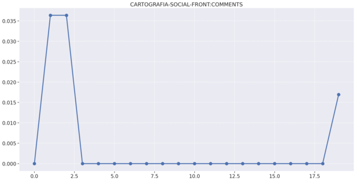
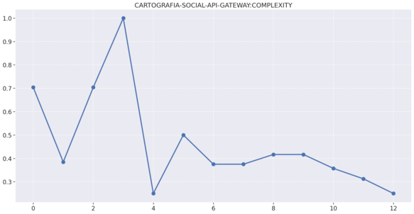
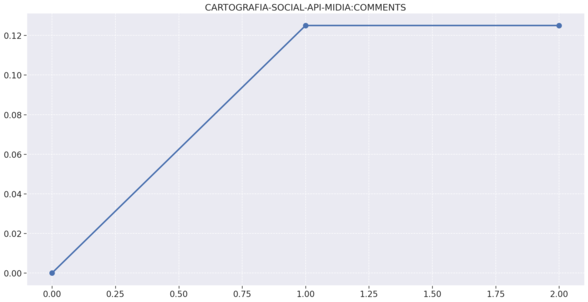
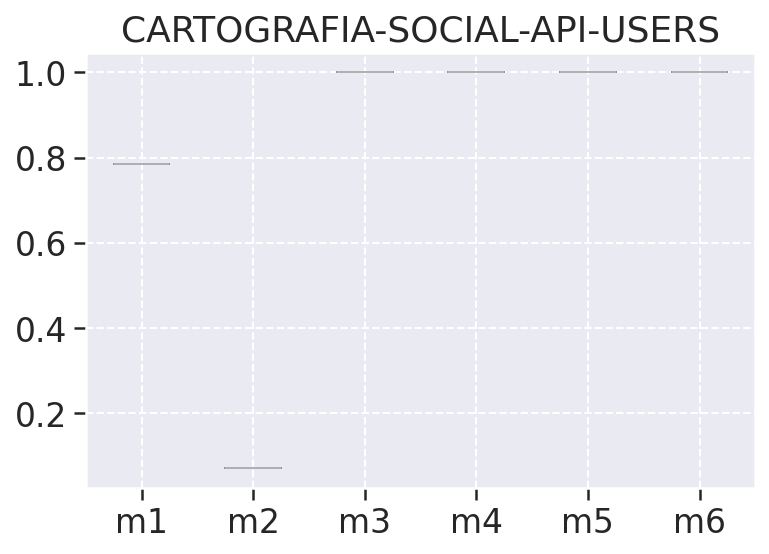

## Análise de métricas de Maintainability e Reliability dos Repositórios da Cartografia Social

Métricas de software são medidas quantitativas de atributos que um sistema de sotware possui, esses atributos ou parâmetros afetam  o desenvolvimento de um software o por isso devem ser análisados. 

Existem várias atividades que englobam a prática de coleta de metricas de software, essas atividades envolvem coleta de dados, modelos e medidadas de qualidade, modelos e medidas de estimativa de custo e esforço etc.

Durante o projeto nós aplicamos algumas dessas práticas no desenvolvimento do produto coletando métricas de manutenibilidade e confiabilidade do nosso produto através de uma ferramenta de coleta de métricas chamada SonarQube, ele inspeciona o código de cada um dos nossos repositórios de forma contínua e detecta diversos aspectos acerca do nosso código como bugs, complexidade de código, densidade, cobertura de código e outros.

A cada release gerada nos repositórios é disponibilizado um arquivo .json que nos retorna alguns aspectos do nosso código feito para aquela release. A partir desses arquivos nós geramos um dataset e o manipulamos para realizarmos uma análise das métricas utilizando algumas ferramentas do pyhton com as bibliotecas pandas, numpy e outras.

As seguintes métricas foram coletadas a cada release gerada e salvas num arquivo json da release, cada repositório contém um diretório com todos os arquivos das releases:

metric_list = ['files',
               'functions',
               'complexity',
               'comment_lines_density',
               'duplicated_lines_density',
               'coverage',
               'ncloc',
               'security_rating',
               'tests',
               'test_success_density',
               'test_execution_time',
               'reliability_rating']

Essas métricas foram colhetadas para todos os repositórios e salvas num csv chamado result2.csv.

Após colhermos os dados fizemos as seguintes análises para cada repositório.

## Gráficos de complexidade,duplicações e comentários por repositório

### Frontend

### Gateway

### Midias

### Users

### Mapas

## Análise de estatistica descritiva (média, moda, mediana, desvio padrão, variância, mínimo, máximo )

- Realiza o cálculo de dados estatísticos de medidas de tendência central, como média, mediana, moda e percentis. Já as medidas de dispersão são o mínimo, máximo, desvio padrão e variância.Esta fase é a fase inicial da nossa análise de dados para descrever e resumir os nossos dados análisados.

Interpretando os dados:

- Média: Média dos valores do conjunto de dados
- Mediana: A mediana é o valor da váriavel que ocupa posição central do conjunto de dados ordenado. Na tabela de análise descritiva o valor 50% é o valor da mediana, e os valores de 75% e 25% são os percentis superiores e inferiores respectivamente, para uma melhor visualização ao fim da tabela foi adicionado um campo chamado mediana, porém o mesmo é igual ao valor de 50% já apresentado.
- Moda: Valor mais recorrente do conjunto de dados.
- Máximo: Maior valor do conjunto de dados
- Desvio padrão (std): Indica a dispersão do conjunto de dados, quanto mais próximo esse valor estiver de 0 mais homogêneo é o conjunto.
- Variância: Menor valor do conjunto de dados.
- Percentis: Os percentis incluidos na saída estão entre 0 e 1 e retornam o percentis de 25%, 50% e 75%

## Tabelas descritivas por repositório

### Frontend

### Gateway

### Comunidades

### Mapas

### Midias

### Users

## Percentis

Medida que divide uma amostra de dados ordenados de forma crescente em 100 partes. Calculamos o percentis de 0% a 99% da amostra para cada métrica pois assim poderemos analisar por exemplo em quantos porcento determinado tempo é levado para executar a build de teses. 

## Tabelas de Percentis por repositório

### Frontend

### Gateway

### Comunidades

### Mapas

### Midias

### Users

## Matriz de Correlação

* Duas estátisticas estão correlacionadas quando existe qualquer associação estatística entre elas, essa correlação pode ser o quão porximas duas váriavéis estão de ter uma relação linear entre si. Aqui usamos a correlação de Pearson onde os valores de r vão de -1 a 1, essa correlação é positiva quando r > 0, isso significa que ambas as váriaveis se movem na mesmas direção, ou essa correlação pode ser negativa (r < 0), que é quando as váriaveis andam em direções opostas.

- Correlação positiva: ambas as variáveis mudam na mesma direção. (r > 0)
 - Correlação Nula: Nenhuma relação na mudança das variáveis. (r = 0 ou Nulo)
- Correlação Negativa: as variáveis mudam em direções opostas. (r < 0)

* Pela fórmula a correlação é um número entre -1 e 1 e interpretamos da seguinte maneira: quanto mais o r estiver próximo de 1 ou -1 mais forte será a correlação.

## Matriz de correlação por repositório

### Frontend

### Gateway

### Comunidades

### Mapas

### Midias

### Users

## Gráfico boxplot

Nos ajuda a observar a variação das métricas coletadas por meio do quartis, ous seja dos percentis inferiores e superiores juntamente com a mediana, na tabela de análise descritiva podemos ver o percentil inferior representado pelo valor 25%, a mediana 50%, e o percentis superior como 75%. Além do quartis temos nesses gráficos também os outliers representados por bolinhas, que são os valores descrepantes plotados como pontos individuais, esses pontos são os pontos que ultrapassam os limites inferiores e superiores dos nossos dados. 

## Boxplot por repositório

### Frontend

### Gateway

### Comunidades

### Mapas

### Midias

### Users

## Gráfico de Dispersão - Qualidade total

- O gráfico de dispersão geralmente mostra a correlação entre duas váriaveis e como elas se afetam, aqui os pares de dados que se relacionam é o de manutenibilidade e confiabilidade. Tanto a métrica de confiabilidade quanto a de manutenibilidade são métricas de qualidade de software definidas na ISO 9121, e elas nos ajudam a definir aspectos de qualidade externa e interna do produto e fazem parte do modelo de qualidade, além disso temos tambeḿ sub-aspectos em cada uma dessas caracteristica que as fazem tem o seu aspecto principal. Cada uma dessas métricas indicam alguns aspectos do nosso produto e iremos abordalos mais a fundo para uma melhor compreensão do nosso gŕafico de dispersão.

- Manutenibilidade (Maintainability): Essa métrica nos diz respeito a capacidade do produto de software de ser modificado. As modificações podem incluir correções, melhorias ou adaptações. Usando as métricas m1, m2, m3, fizemos um cálculo da manutenibilidade dos repositórios do projeto afim de compararmos com a métrica de confiabilidade. 

- Confiabilidade (Reliability): Capacidade do produto de software de manter um nível de desempenho especificado, quando usado em condições especificadas.Usando as métricas m4, m5, m6, fizemos um cálculo da confiabilidade dos repositórios do projeto afim de compararmos com a métrica de manutenibilidade.

### Interpretando o Gráfico de Dispersão

Com base nas definições citadas acima podemos então interpretar o gráfico de dispersão dos aspectos de qualidade citados acerca dos repositórios do projeto, esse gráfico plota os pontos de qualidade de todos os repositórios e correlaciona manutenibilidade x confiabilidade além de nos mostrar uma barra lateral que indica a qualidade total. Esse gráfico tem escala que vai de 0 a 1 sendo 0 nenhuma qualidade e 1 qualidade máxima. 

Podemos observar que o projeto não conseguiu atingir o nível um de qualidade das métricas citadas porém chegou em um bom valor de 0.825, podemos ver também que quanto mais a manutenibilidade cresce, mais cresce a confiabilidade do projeto o que também acarreta uma subida no aspecto de qualidade geral.

Apesar de não termos conseguido chegar a uma qualidade máxima ao decorrer do projeto a qualidade foi melhorando e isso decorre de uma maior cobertura de testes e também de uma melhor implementação de código e diminuição de complexidade.

## Gráfico de Histograma - qualidade total

O gráfico de histograma geralmente mostra a ocorrência de um determinado valor em um determinado intervalo, um exemplo fácil para se entender um gráfico de histograma e plotar um gráfico de número de jogadores de futebol de um time x Idade, ou seja, esses dados em um gráfico de histograma nos mostram a quantidade de jogadores de uma determinada idade. 

No nosso projeto usaremos esse gráfico para plotar o ocorrência das métricas de qualidade do nosso dataset final, afim de analisarmos a Manutenibilidade e a Confiabilidade do nosso projeto, como todas as métricas ocorrem no intervalo de 0 a 1 sendo 0 nenhuma qualidade, e 1 a maior qualidade possível.

As métricas analisadas são as métricas de m1 a m6, Maintainability, Reliability e total, a ultima reprensenta um valor de qualidade de cada release de cada repositório com base nas métricas citadas anteriormente.

### Interpretando os gráficos de histograma da cada métrica.

**m1**: A m1, ou métrica 1, diz respeito a a complexidade do código que diz respeito a quantidade de caminhos independentes ou ciclos encontrados em um código, esse gráfico corresponde a ocorrencia da m1 em todos os repoositórios, é possível notar que essa métrica tem sua maior ocorrência no valor de 0.8 com um pouco mais de 12 aparições, ou seja não é o melhor possível mas é um valor acima da média, a segunda maior ocorrência ocorre em 0.6 com 10 aparições, ainda é um valor acima da média, entretanto poderia ser melhor para os parâmetros de qualidade. Por fim temos os extremos 0 e 1, onde temos a ocorrência de 1 apenas umas vez o 0 aparece um pouco mais de 2 vezes.

**m2**: A m2, ou métrica dois, é a densidade de arquivos comentados, essa métrica conta o número de linhas comentadas no código. É possível notar que temos poucas linhas de código comentadas e a maior ocorrência se dá no valor 0. 

**m3**: A métrica 3, ou m3, é duplicated_lines_density e diz respeito a quantidade de linhas de código duplicadas, aqui temos a maior ocorrência dessa métrica em 1, o que é um bom indicador de qualidade tendo em vista que isso é um forte indicador de nosso código tem um baixo nível de acoplamento e um alto nível de coesão, o que é muito bom pois isso incrementa a métrica de manutenibilidade diretamente.

**m4:** A métrica 4, ou m4, é test_success_density, ou seja é a densidade de testes unitário executados com sucesso, essa métrica no nosso projeto se saiu pois no geral os valores se aproximam muito de 1 o que é um bom indicador que os testes foram bem executados e rodaram conforme o esperado. 

**m5:** A m5, ou métrica 5, diz respeito ao tempo de execução de testes unitátrios e também se saiu bem com seu valores se aproximando de um, de fato os testes são executados de maneira bem rápida e eficiente.

**m6:**  A métrica 6 diz respeito ao coverage a também tem sua maior ocorrência em 1, entretanto essa métrica apenas observada dessa forma não se aproxima muito bem da realidade tendo em vista que ela olha todos os arquivos com extensão ts ou js, e não necessáriamente todos esses arquivos precisam ser testados ou são código de funcionalidade, nossa cobertura de testes é boa porém não chega a 100 em nenhum repositório.

**Manutenibilidade:** Métrica de qualidade médida pelo sonarqube com base nas outras métricas coletadas e que estão disponíveis nos jsons, ela leva em conta os code_smells e outros, é possível observar que essa métrica tem seu maio indice de ocorrência em 0.275 e 0.300, o que mostra que a maiora das ocorrências tem nota D, o que não é muito bom porém também existe margem de erro para esses dados e conseguiriamos melhorar essas métricas eliminando code smells, diminuido linhas de comentários etc.

**Confiabilidade:** A métrica de confiailidade tem sua maior ocorrência em 0.5 o que não é a melhor possível entretanto está na média, ela ocorre devido a bugs e aumenta conforme a gravidade do bug e outros, não temos nenhum bug critico entretanto temos bugs menores que fazem nossa confiabilidade cair.

**total:** A métrica total indica a qualidade total de todo o projeto levando em conta as métricas citadas, ela tem sua maior ocorrência em 0.75, é um bom valor e nos demonstra apenas o que já foi dito pela junção das outras métricas, algumas estão muito bem, outras nem tanto e no total nenhum repositório atingiu níveis de qualidade maiores ou iguais a 1.

## Referências
---

1. **[NBR ISO/IEC 9126-1]** Engenharia de software - Qualidade de
produto. <a href="https://jkolb.com.br/wp-content/uploads/2014/02/NBR-ISO_IEC-9126-1.pdf">**https://jkolb.com.br/wp-content/uploads/2014/02/NBR-ISO_IEC-9126-1.pdf**</a> (último acesso:
2019)

2. https://rstudio-pubs-static.s3.amazonaws.com/437792_df39a5ff0a55491fb71f0f4a0f5cd0bf.html

***

## Versionamento de edições desta página
---

| Data | Autor | Descrição | Versão |
|------|-------|-----------|--------|
| 08/09/2021 | Lorrany| Criação da página e dos textos descritivos, adição de algumas referências| 0.1 |
