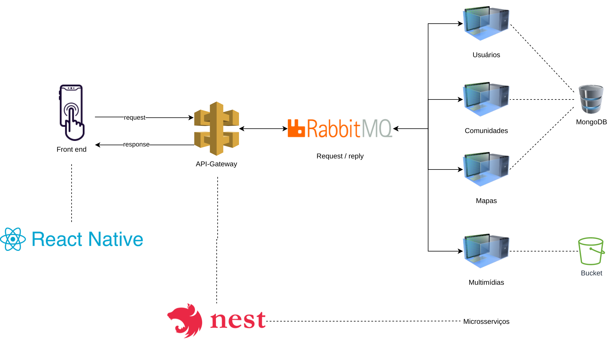

# Definição arquitetural do projeto

## Histórico de revisões

|Data|Versão|Descrição|Autor(es)|
|:---:|:---:|:---:|:---:|
|31/08/2021|1.0| Adição da introdução e Representação da arquitetura |[Elias Bernardo](https://github.com/ebmm01), [Guilherme Guy](https://github.com/guilherme1guy)|

## Introdução

### Finalidade

A intenção desse documento é documentar e transmitir informações relevantes ao projeto da __Cartografia Social__ do ponto de vista arquitetural. Facilitando a visualização e entendimento da estrutura do projeto.

### Escopo

Este Documento de Arquitetura de Software se aplica ao Sistema __Cartografia Social__. Desenvolvido na disciplina de EPS da Universidade de Brasília.

### Definições, Acrônimos e Abreviações

- __UnB__ - Universidade de Brasília
- __FGA__ - Faculdade do Gama
- __Backend__ - Parte do sistema responsável por prover e organizar recursos para a interfáce do sistema
- __Frontend__ - Parte do sistema responsável por ser a interfáce entre o sistema e o usuário
- __HTTP__ - Hypertext Transfer Protocol
- __API__ - Application Programming Interface

## Representação da Arquitetura

### Componentes Importantes

__React Native__

...

__NestJs:__

O NestJS é uma framework que permite construir aplicações de servidor de forma escalável e eficiente, utilizando o Node.js. Por causa do TypeScript a framework consegue lidar com uma combinação elementos dos paradigmas de programação orientado a objetos e também do paradigma funcional.  Foi escolhido por ser fortemente tipado e incluir uma série de implementações e ferramentas para auxiliar o desenvolvimento.

__RabbitMQ:__

RabbitMQ é um message broker de código aberto escrito em earlang. Foi escolhido como Provider para a comunicação entre a API Gateway e os microsserviços, de forma a garantir a independência e desacoplamento entre eles.

__Microserviços:__

A arquitetura de microsserviços é uma solução arquitetural distribuída que desmembra o sistema da aplicação em pequenos blocos independentes, chamados de serviços. Cada um possuíndo seus próprios processos e responsabilidades, e se comunicam com o API Gateway através de um message broker utilizando o RabbitMQ. Os serviços utilizados na aplicação serão:

- Usuário, serviço responsável por conter as lógicas de autenticação e armazenar as informações dos usuários.
- Comunidade, serviço responsável por tratar toda a lógica que envolve uma comunidade e as permissões de acesso. Desenvolvido utilizando NestJS.
- Mapa, serviço responsável por conter as informações a respeito dos mapas, pontos, áreas e relativos. Desenvolvido utilizando NEstJS.
- Mídia, serviço responsável por gerênciar os arquivos de multimídia fornecidos pelos usuários da aplicação

__Comunicação entre serviços:__

A comunicação entre os serviços será realizada através da API Gateway, responsável por utilizar o protocolo HTTP para intermediar a comunicação com o front end (aplicação mobile React Native) e um message broker com RabbitMQ para comunicação com os microsserviços.

### Diagrama de Arquitetura

