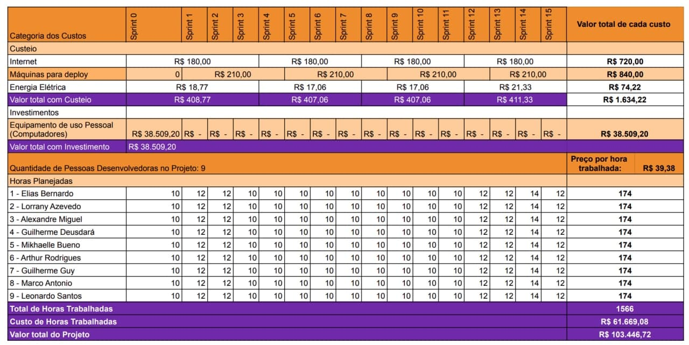

# Gerenciamento de Custos

## Histórico de revisões

|Data|Versão|Descrição|Autor|
|:---:|:---:|:---:|:---:|
|09/09/2021 |1.0| Adição da Tabela de Custos do Projeto |[Lorrany dos Santos](https://github.com/lorryaze)|
|09/09/2021|1.1|Adição de descrições do gerenciamento de custos|[Alexandre Miguel](https://github.com/aleronupe) e [Lorrany dos Santos](https://github.com/lorryaze)|
|10/09/2021|1.2|Adição de descrições acerca de EVM e Agile EVM|[Alexandre Miguel](https://github.com/aleronupe)|

## Tabela Geral de Custos do Projeto

Para o planejamento de custos do Projeto, foi realizada uma análise de diversos fatores mercadológicos para a construção da seguinte tabela, sumarizando os diversos aspectos que geram custos para o projeto como um todo.

## Custos Por Categoria
### Desenvolvimento

Para o custo médio de desenvolvimento foi estimado a quantidade de horas de trabalho total por membro do projeto, por sprint, para um custeio embasado na obtenção dos [dados de um salário médio de um desenvolvedor](https://www.payscale.com/research/BR/Job=Software_Developer/Salary) em nível de experiência médio, adequado às experiências dos membros, permitindo dispor os dados conforme a seguinte tabela:

| Sprints | Horas Por Membro | Total de Membros | Total de Horas | Custo Por Hora (R$) | Custo Total (R$) |
| --- | --- | --- | --- | --- | --- |
| 00 | 10 | 9 | 90 | 39,38 | 3.544,20 |
| 01 | 12 | 9 | 108 | 39,38 | 4.253,04 |
| 02 | 12 | 9 | 108 | 39,38 | 4.253,04 |
| 03 | 10 | 9 | 90 | 39,38 | 3.544,20 |
| 04 | 10 | 9 | 90 | 39,38 | 3.544,20 |
| 05 | 10 | 9 | 90 | 39,38 | 3.544,20 |
| 06 | 10 | 9 | 90 | 39,38 | 3.544,20 |
| 07 | 10 | 9 | 90 | 39,38 | 3.544,20 |
| 08 | 10 | 9 | 90 | 39,38 | 3.544,20 |
| 09 | 10 | 9 | 90 | 39,38 | 3.544,20 |
| 10 | 10 | 9 | 90 | 39,38 | 3.544,20 |
| 11 | 10 | 9 | 90 | 39,38 | 3.544,20 |
| 12 | 12 | 9 | 108 | 39,38 | 4.253,04 |
| 13 | 12 | 9 | 108 | 39,38 | 4.253,04 |
| 14 | 14 | 9 | 126 | 39,38 | 4.961,88 |
| 15 | 12 | 9 | 108 | 39,38 | 4.253,04 |
| **Total** | **174** | **9** | **1566** | **39,38** | **61.669,08** |

### Aquisições

O Principal fator que representa custo para o projeto foi determinado como a aquisição de computadores de uso pessoal, cuja principal especificação técnica se refere aos seguintes aspectos:

- Processador Intel Core i7;
- 8 GB de Memória RAM;
- 256 GB de *SSD*.

Seguindo esses aspectos, foi realizada uma [análise dos preços e dos modelos](https://www.notebookcheck.net/The-best-laptops-for-Q2-2021-80-laptops-in-review.549940.0.html) disponíveis no mercado, sendo possível obter os seguintes dados: 

| Dispositivo | Descrição de Uso | Quantidade | Valor Unitário Médio (R$) | Valor Total (R$) |
| --- | --- | --- | --- | --- |
| Notebook | Desenvolvimento, testes e contribuições gerais em documentação e gerência | 9 | 4.278,80 | 38.509,20 |

### Gasto Energético

Tendo que, para o desenvolvimento, seria necessário o gasto energético associado ao uso contínudo dos equipamentos adquiridos e especificados no item anterior, foi necessário identificar o preço do [***KWh*** da região de Brasília](https://www.neoenergiabrasilia.com.br/residencial-e-rural/Paginas/tarifas.aspx) para a execução do seguinte cálculo:

`Potência do Dispositivo em KW` **x** 
`Total de Horas Trabalhadas Na Sprint` **x**
`Preço do KWh` =
`Gasto Energático da Sprint`

Tendo que a potência por Aparelho é de **0,06 KW** e que são 9 aparelhos no total, além de que o preço do KWh na região é de **0,7941717 R$/KWh**, possível montar a seguinte tabela

| Sprint | Total de Horas | Potência Total da Sprint (KW) | Gasto da Sprint (R$) |
| --- | --- | --- | --- |
| 00 | 90 | 5,4 | 4,29 |
| 01 | 108 | 6,48 | 5,14 |
| 02 | 108 | 6,48 | 5,14 |
| 03 | 90 | 5,4 | 4,29 |
| 04 | 90 | 5,4 | 4,29 |
| 05 | 90 | 5,4 | 4,29 |
| 06 | 90 | 5,4 | 4,29 |
| 07 | 90 | 5,4 | 4,29 |
| 08 | 90 | 5,4 | 4,29 |
| 09 | 90 | 5,4 | 4,29 |
| 10 | 90 | 5,4 | 4,29 |
| 11 | 90 | 5,4 | 4,29 |
| 12 | 108 | 6,48 | 5,14 | 
| 13 | 108 | 6,48 | 5,14 | 
| 14 | 126 | 7,56 | 6,00 | 
| 15 | 108 | 6,48 | 5,14 | 
| **Total** | **1566** | **93,96** | **74,22** |

## Referências

* [**Informações técnicas de** ***Notebooks Check***](https://www.notebookcheck.net/The-best-laptops-for-Q2-2021-80-laptops-in-review.549940.0.html)

* [**Preço por hora de trabalho de desenvolvimento no Brasil**](https://www.payscale.com/research/BR/Job=Software_Developer/Salary)

* [**Dados Tarifários da NeoEnergia (Brasília)**](https://www.neoenergiabrasilia.com.br/residencial-e-rural/Paginas/tarifas.aspx)

