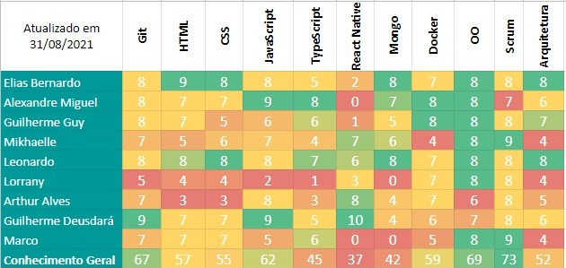
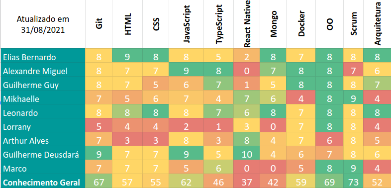
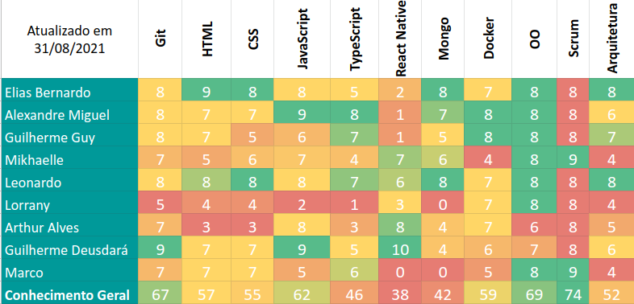
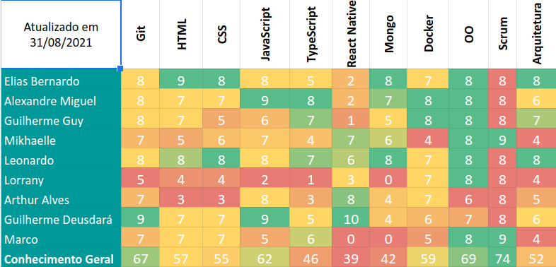
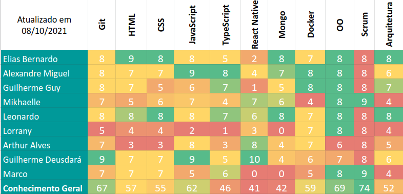
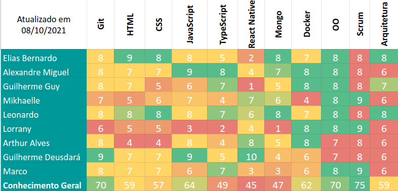
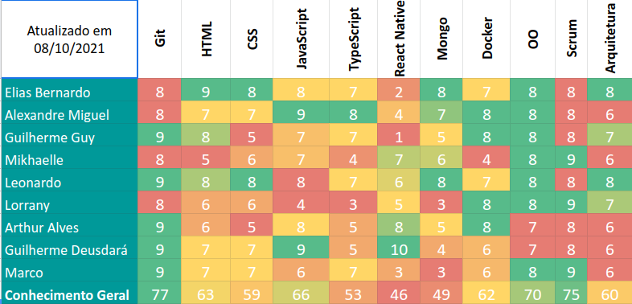
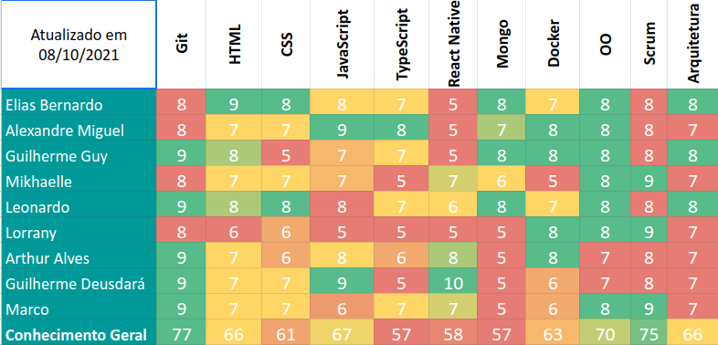
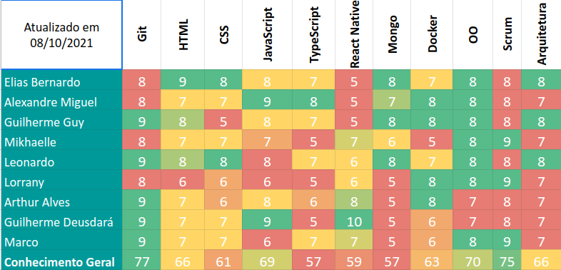

# Quadro de conhecimentos
Este documento tem por finalidade mostrar o conhecimento dos integrantes da equipe, em relação as tecnologias que serão usadas no desenvolvimento do projeto.

## Sprint 1

## Sprint 2

## Sprint 3

## Sprint 4

## Sprint 5

## Sprint 6

## Sprint 7

## Sprint 8

## Sprint 9

***
## Versionamento de edições desta página
---

| Data | Autor | Descrição | Versão |
|------|-------|-----------|--------|
| 01/09/2021 | Marco Antônio | Criação da página e adição do primeiro quadro de conhecimento | 0.1 |
| 08/11/2021 | Leonardo Barreiros | Inserindo novas métricas | 0.2 |
