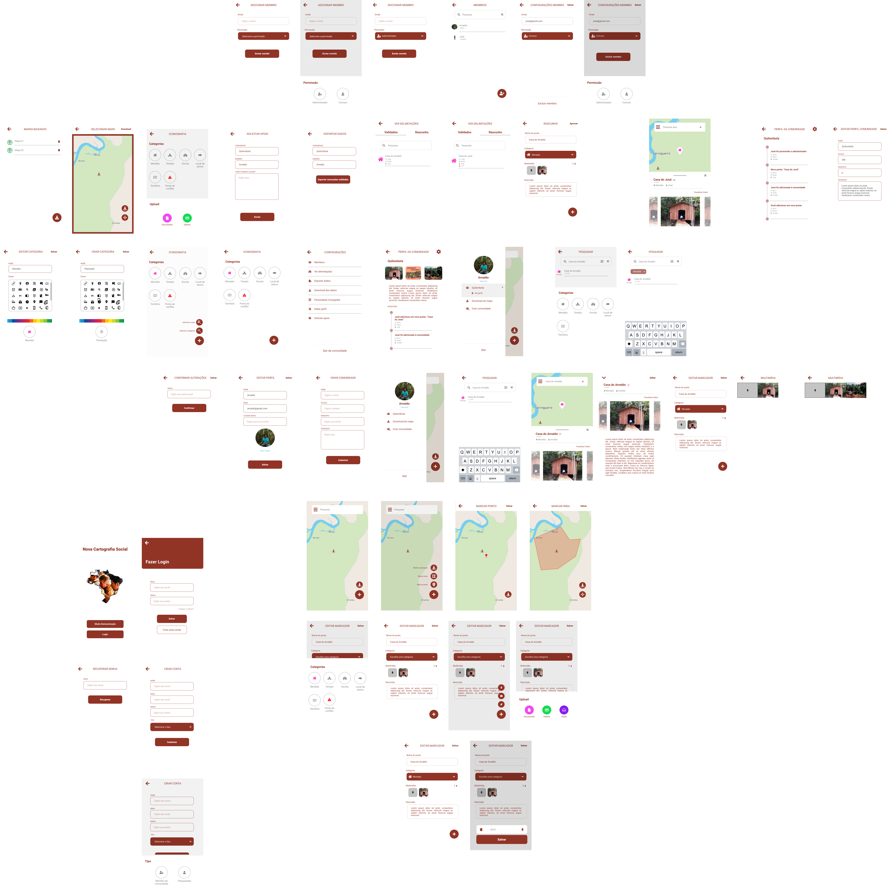

# **Protótipo de Alta Fidelidade**

## Histórico de revisões

|Data|Versão|Descrição|Autor|
|:---:|:---:|:---:|:---:|
|08/09/2021|1.0|Criação da página e adição de conteúdo |[Arthur Rodrigues](https://github.com/arthurarp)|
|08/09/2021|1.1|Adição de protótipo |[Arthur Rodrigues](https://github.com/arthurarp) e [Marco Antônio](https://github.com/markinlimac)|

## Protótipo

[Link para o protótipo completo no figma](https://www.figma.com/file/21l9Uze8atLKTWZjgWYge3/Prot%C3%B3tipo-Alta-FIdelidade?node-id=167%3A49)

Abaixo temos uma visão geral das principais telas do aplicativo.

