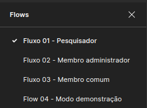

# **Protótipo de Alta Fidelidade**

## Histórico de revisões

|Data|Versão|Descrição|Autor|
|:---:|:---:|:---:|:---:|
|08/09/2021|1.0|Criação da página e adição de conteúdo |[Arthur Rodrigues](https://github.com/arthurarp)|
|08/09/2021|1.1|Adição de protótipo |[Arthur Rodrigues](https://github.com/arthurarp) e [Marco Antônio](https://github.com/markinlimac)|
|09/09/2021|1.2|Adição do tópico Introdução e uma imagem da nova visão geral |[Arthur Rodrigues](https://github.com/arthurarp)
|09/09/2021|1.3|Adição do tópico de fluxos e link para protótipo interativo |[Arthur Rodrigues](https://github.com/arthurarp)

## Introdução

 Um protótipo de alta fidelidade é uma ferramenta bastante utilizada no processo de validação, pois é um artefato geralmente construído na fase inicial do projeto. Ele representa, de uma forma bastante próxima, o resultado final do produto em termos de design e navegação, permitindo que o cliente já possa obter uma primeira experiência de uso. E nesse primeiro contato o cliente pode verificar, de maneira rápida, se o produto está atendendo às suas expectativas na questão do visual e navegação. 

## Protótipo

[Link para o protótipo completo no figma](https://www.figma.com/file/21l9Uze8atLKTWZjgWYge3/Prot%C3%B3tipo-Alta-FIdelidade?node-id=167%3A49)
 
 
 
Abaixo temos uma visão geral das principais telas do aplicativo.
 
 

## Fluxos

[Link para o protótipo no modo interativo](https://www.figma.com/proto/21l9Uze8atLKTWZjgWYge3/Protótipo-Alta-FIdelidade?node-id=272%3A2335&scaling=min-zoom&page-id=167%3A49&starting-point-node-id=272%3A2335&show-proto-sidebar=1)

O protótipo interativo possui 4 fluxos:

 
 

- **Fluxo 01 - Pesquisador:**

Mostra as principais funções de um usuário pesquisador, como criar comunidades, adicionar membros e validar rascunhos.

 
 

- **Fluxo 02: Membro administrador de uma comunidade**
 

Que apresenta todas as mesmas funcionalidades do membro comum (Fluxo 03), só que permite também adicionar novos membros à comunidade e editar o perfil da comunidade.
 
 

- **Fluxo 03: Membro comum de uma comunidade**
 

Apresenta funcionalidades como: marcar ponto no mapa, adicionar elementos de multimídia, de pesquisar por pontos no mapa, solicitar apoio, fazer o download do mapa para utilizá-lo de forma offline, personalizar a iconografia (adicionando novas categorias e ícones).
 
 

- **Fluxo 04: Modo demonstração**
 
Um modo que apresenta funcionalidades como marcar ponto no mapa e solicitar acesso (solicitar criação de comunidade).
