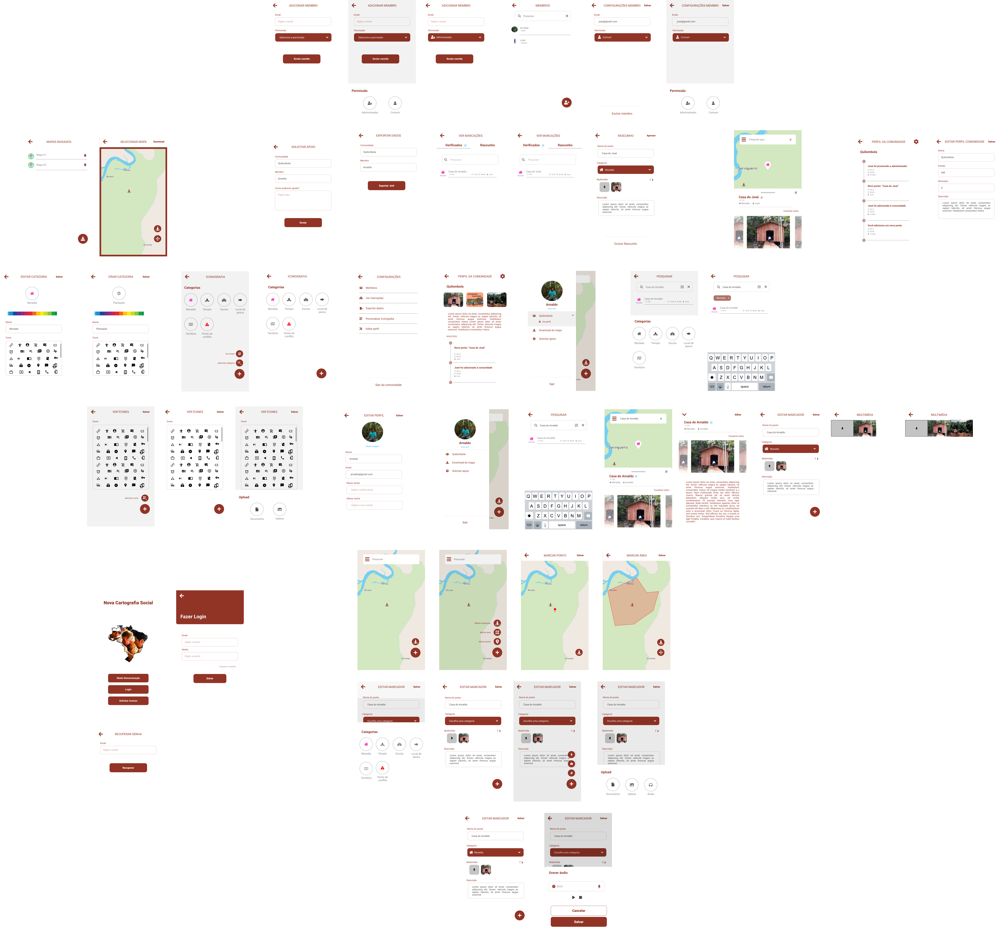

# **Protótipo de Alta Fidelidade**

## Histórico de revisões

|Data|Versão|Descrição|Autor|
|:---:|:---:|:---:|:---:|
|08/09/2021|1.0|Criação da página e adição de conteúdo |[Arthur Rodrigues](https://github.com/arthurarp)|
|08/09/2021|1.1|Adição de protótipo |[Arthur Rodrigues](https://github.com/arthurarp) e [Marco Antônio](https://github.com/markinlimac)|
|09/09/2021|1.2|Adição do tópico Introdução e uma imagem da nova visão geral |[Arthur Rodrigues](https://github.com/arthurarp)

## Introdução

 Um protótipo de alta fidelidade é uma ferramenta bastante utilizada no processo de validação, pois é um artefato geralmente construído na fase inicial do projeto. Ele representa, de uma forma bastante próxima, o resultado final do produto em termos de design e navegação, permitindo que o cliente já possa obter uma primeira experiência de uso. E nesse primeiro contato o cliente pode verificar, de maneira rápida, se o produto está atendendo às suas expectativas na questão do visual e navegação. 

## Protótipo

[Link para o protótipo completo no figma](https://www.figma.com/file/21l9Uze8atLKTWZjgWYge3/Prot%C3%B3tipo-Alta-FIdelidade?node-id=167%3A49)
Abaixo temos uma visão geral das principais telas do aplicativo.

