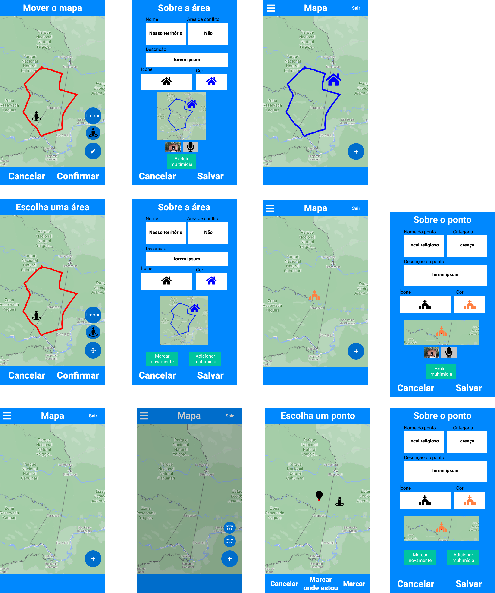
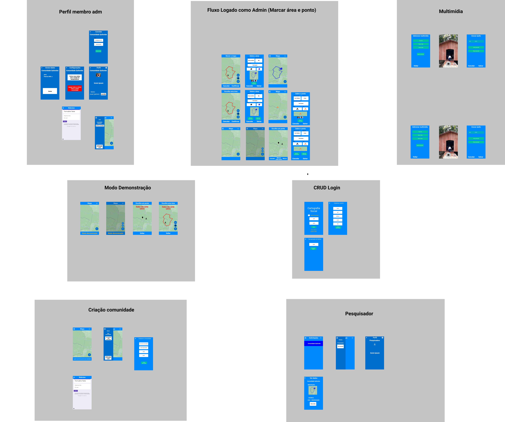

# **Protótipo de Baixa Fidelidade**

## Histórico de revisões

|Data|Versão|Descrição|Autor|
|:---:|:---:|:---:|:---:|
|27/08/2021|1.0|Criação da página e adição de conteúdo |[Arthur Rodrigues](https://github.com/arthurarp)|

## Protótipo 1

|Autor|Versão|
:------:|:------:|
|[Arthur Rodrigues](https://github.com/arthurarp)| 1.0 |

Abaixo segue o protótipo com um dos principais fluxos do aplicativo

Aproveitando esse trabalho inicial de fidelidade baixa, que foi feito no figma, decidi ir além e adicionar algumas interações entre as telas existentes e adicionar mais telas, o que acabou gerando um modelo de média fidelidade que contém 4 diferentes fluxos.

Abaixo uma imagem do protótipo gerado. A versão interativa pode ser acessada [neste link](https://www.figma.com/proto/FAQeDMukc2kF31Nsz61vb0/Protótipo-Média-Fidelidade?node-id=1%3A7&scaling=contain&page-id=0%3A1&starting-point-node-id=1%3A7&show-proto-sidebar=1).

