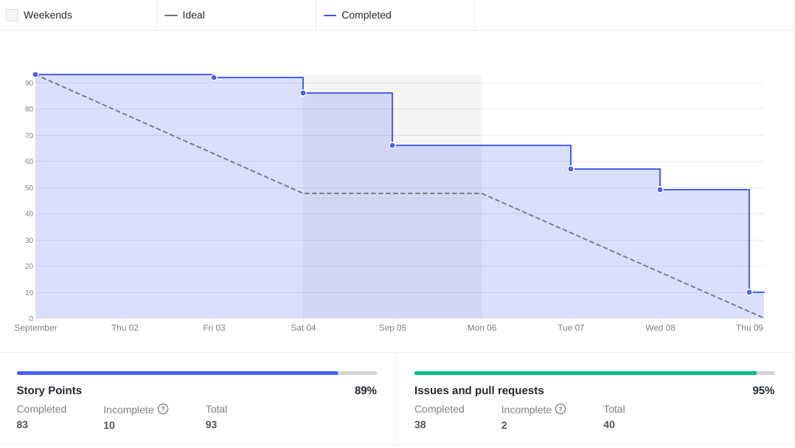
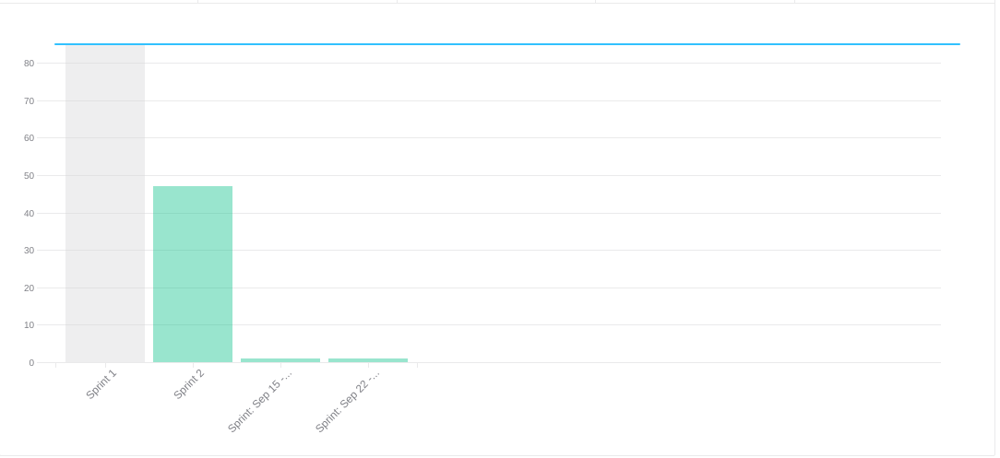

# Sprint 1

## Planejamento

__Início da sprint:__ 01/09/2021

__Término da sprint:__ 09/09/2021

O foco do planejamento da sprint 01 se deu em atualizar a wiki com toda a documentação que tínhamos até o momento, e também realizar um pontapé inicial do desenvolvimento do projeto. Dito isto, as seguintes issues foram planejadas:

| Issue | Tipo | Descrição | Responsáveis |
|--|--|----|--|
| [#21](https://github.com/fga-eps-mds/2021.1-Cartografia-social-docs/issues/21) | Documentação | Documentar visão do produto | Leonardo, Arthur |
| [#20](https://github.com/fga-eps-mds/2021.1-Cartografia-social-docs/issues/20) | Documentação | Documentar a Lean Inception | Marco |
| [#17](https://github.com/fga-eps-mds/2021.1-Cartografia-social-docs/issues/17) | Documentação | Documentar planejamento de comunicação interna/externa, agenda de trabalho e  ferramentas | Guilherme Guy |
| [#19](https://github.com/fga-eps-mds/2021.1-Cartografia-social-docs/issues/19) | Documentação | Documentar Sprint Planing 01 | Elias Bernardo |
| [#22](https://github.com/fga-eps-mds/2021.1-Cartografia-social-docs/issues/22) | Documentação | Elaborar documento de qualidade e custos | Lorrany, Mikha |
| [#24](https://github.com/fga-eps-mds/2021.1-Cartografia-social-docs/issues/24) | Documentação | Elaborar documento de analise de riscos | Lorrany, Mikha |
| [#2](https://github.com/fga-eps-mds/2021.1-Cartografia-social-docs/issues/2) | Documentação, Prototipagem | Protótipo de Alta Fidelidade | Arthur, Marco, Mikha |
| [#3](https://github.com/fga-eps-mds/2021.1-Cartografia-social-front/issues/3) | Feature | [US11] Criar tela de visualização do mapa | Alexandre, Deusdará |
| [#3](https://github.com/fga-eps-mds/2021.1-Cartografia-social-front/issues/3) | Feature | [US10] Botão de ver mapa (como tela de login) | Deusdará, Arthur |
| [#2](https://github.com/fga-eps-mds/2021.1-Cartografia-social-docs/issues/2) | Feature | [US36] Questionário para criação de uma nova comunidade | Elias, Léo, Guy |
| [#2](https://github.com/fga-eps-mds/2021.1-Cartografia-social-api-mapas/issues/2) | Feature | [US01] Preparar api para receber e enviar os dados de marcação de pontos no mapa | Elias, Lorrany |
| [#4](https://github.com/fga-eps-mds/2021.1-Cartografia-social-front/issues/4) | Feature | [US01] Preparar a tela de marcação do mapa & integrar com back-end | Alexandre, Deusdará |
| [#2](https://github.com/fga-eps-mds/2021.1-Cartografia-social-front/issues/2), [#4](https://github.com/fga-eps-mds/2021.1-Cartografia-social-api-mapas/issues/4), [#3](https://github.com/fga-eps-mds/2021.1-Cartografia-social-api-users/issues/3), [#3](https://github.com/fga-eps-mds/2021.1-Cartografia-social-api-midia/issues/3), [#4](https://github.com/fga-eps-mds/2021.1-Cartografia-social-api-comunidades/issues/4), [#6](https://github.com/fga-eps-mds/2021.1-Cartografia-social-api-gateway/issues/6) | DEVOPS | CI/CD do Front e Back (completo) | Deusdará (Front), Elias & Guy (Back) |
| [#2](https://github.com/fga-eps-mds/2021.1-Cartografia-social-front/issues/2) | DEVOPS | Sonar Cloud & Coleta de métricas (configurar) (Para o back está incluso nas issues acima) | Deusdará, Guilherme Guy |
|[#8](https://github.com/fga-eps-mds/2021.1-Cartografia-social-front/issues/8) [#3](https://github.com/fga-eps-mds/2021.1-Cartografia-social-api-gateway/issues/3), [#2](https://github.com/fga-eps-mds/2021.1-Cartografia-social-api-midia/issues/2), [#3](https://github.com/fga-eps-mds/2021.1-Cartografia-social-api-comunidades/issues/3), [#3](https://github.com/fga-eps-mds/2021.1-Cartografia-social-api-mapas/issues/3), [#2](https://github.com/fga-eps-mds/2021.1-Cartografia-social-api-users/issues/2) | Documentação | Melhorar o readme de cada repositório | Elias, Alexandre, Deusdará |

### Papéis

A equipe não definiu papéis específicos, com exceção do Scrum Master. O scrum master irá rotacionar por sprint/semana, sendo que o SM anterior irá ajudar o novo, pareando e distribuindo o conhecimento dessa forma.

__Scrum master:__ Elias

### Outros pontos abordados

Outros pontos também foram abordados durante a reunião de planejamento, dentre eles:

- Conversar com a professora Sheila formas de tornar a reunião mais objetiva, focando na pauta definida para o dia da reunião
- Definir CLOUD a ser usada

## Fechamento

Na reunião de fechamento, verificou-se a necessidade de aumentar em um dia a duração da sprint 01, principalmente para a revisão de alguns documentos. Desas forma, a data de finalização foi alterada do dia 08 para o dia 09 de setembro.

### Burndown

### Velocity

> Obs.: Ignorar o Sprint: Sep 15 & Sprint Sep 22

### Dívidas técnicas

Apesar do esforço da equipe em finalizar tudo até o dia 09 de setembro, ainda verificou-se a necessidade (e de comum acordo entre a equipe) de transferir algumas issues para a sprint 02. Dessa forma as seguintes issues viraram dívidas técnicas:

| Issue | Tipo | Descrição | Responsáveis |
|--|--|----|--|
| [#22](https://github.com/fga-eps-mds/2021.1-Cartografia-social-docs/issues/22) | Documentação | Elaborar documento de qualidade e custos | Lorrany, Mikha, Alexandre  |
| [#2](https://github.com/fga-eps-mds/2021.1-Cartografia-social-docs/issues/2) | Feature | [US36] Questionário para criação de uma nova comunidade | Léo, Guy |
| [#2](https://github.com/fga-eps-mds/2021.1-Cartografia-social-front/issues/2) | DEVOPS | CI/CD do Front  | Deusdará (Front) |
| [#3](https://github.com/fga-eps-mds/2021.1-Cartografia-social-front/issues/3) | Feature | [US11] Criar tela de visualização do mapa (especificamente modo de demonstração) | Alexandre, Deusdará |

### Quadro de pareamentos
 

<iframe width="800" height="470" src="https://docs.google.com/spreadsheets/d/e/2PACX-1vTLHE3O8zIRwIz41POb4DXlbyhoVHY9R9vC0wSL-60NMeFVH0Fk0wqUV2v8AgRGTokYaZmwunInbF3m/pubhtml?gid=1619415756&amp;single=true&amp;widget=true&amp;headers=false"></iframe>

### Quadro de conhecimentos

Conforme documento de [métricas de conhecimento](./metricas/quadro-de-conhecimentos)

### Observações, comentários e melhorias possíveis

A sprint 01 pode ser vista como uma etapa de transição, onde a equipe estava saindo de uma etapa focada em planejamento para iniciar a etapa de desenvolvimento do projeto em si. Isso fez com que a sprint 01 tivesse um foco em documentação, porém também um peso em realizar o setup do back e front end, além de implementações iniciais, e ainda todo o pipeline de DEVOPS. Por esses motivos, somado ao fato de ser o pontapé da equipe no desenvolvimento, houveram algumas inconsistências e falhas que resultaram em dívidas técnicas. Para as próximas equipes, espera-se que a maturidade da equipe seja maior, de forma que não ocorram DT (ou, se ocorrerem, que sejam mínimas).

Por fim, vale salientar que a equipe deve se atentar em pontuar todas as issues, visto que algumas não foram pontuadas.

## Versionamento de edições desta página
---

| Data | Autor | Descrição | Versão |
|------|-------|-----------|--------|
| 08/09/2021 | Elias | Criação do documento | 0.1 |
| 09/09/2021 | [Arthur Rodrigues](https://github.com/arthurarp) | Adição do quadro de pareamentos | 0.2 |
| 15/09/2021 | Elias | Adição do fechamento da sprint 01 | 0.3 |