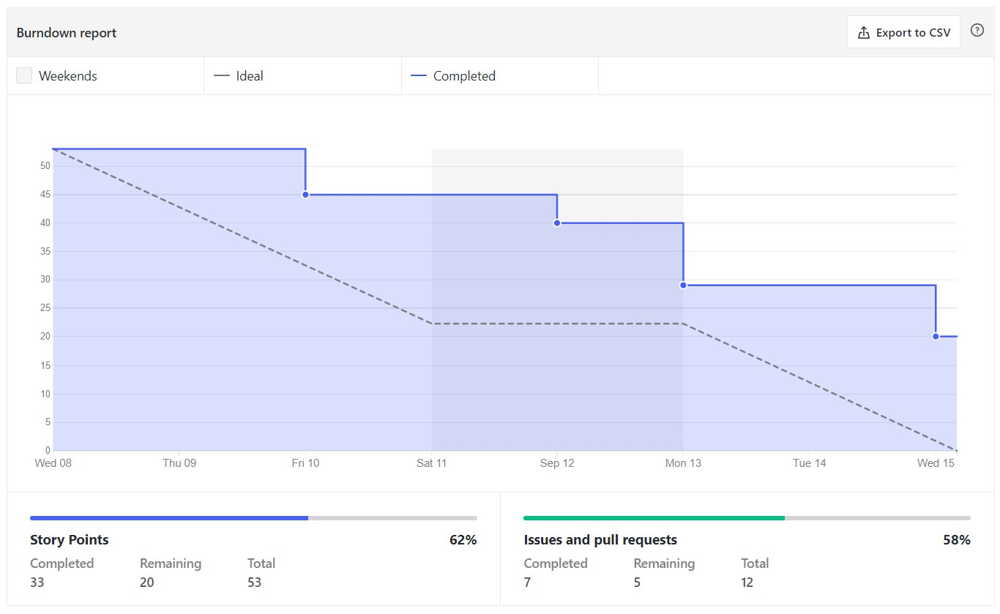
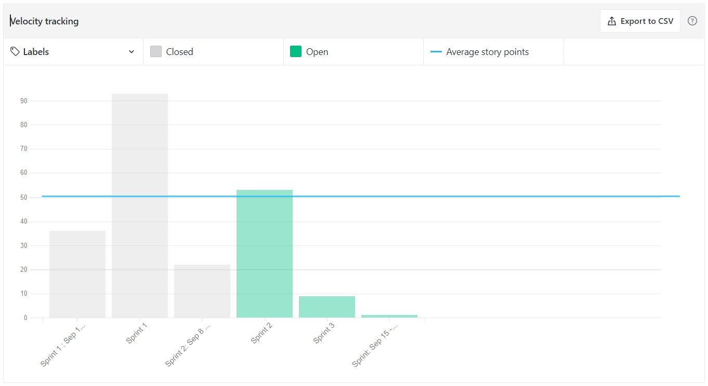

# Sprint 2

## Planejamento

__Início da sprint:__ 09/09/2021

__Término da sprint:__ 15/09/2021

O foco do planejamento da sprint 02 foi criar o CI/CD do front, setar o sonar cloud, coletar métricas, planejar a apresentação da R1 e avançar no desenvolvimento das features de acordo com nossa Lean Inseption e o Product Backlog. Dito isto, as seguintes issues foram planejadas:

| Issue | Tipo | Descrição | Responsáveis |
|--|--|----|--|
| [#78](https://github.com/fga-eps-mds/2021.1-Cartografia-social-docs/issues/78) | Documentação | Documento de Identidade Visual | Arthur, Marco |
| [#82](https://github.com/fga-eps-mds/2021.1-Cartografia-social-docs/issues/82) | Documentação | Documentar fechamento da sprint 01 | Elias |
| [#23](https://github.com/fga-eps-mds/2021.1-Cartografia-social-docs/issues/23) | Documentação | Documentar Custos e Prazos do Projeto | Alexandre, Lorrany |
| [#13](https://github.com/fga-eps-mds/2021.1-Cartografia-social-front/issues/13) | Feature | [US21] Fazer upload de imagens | Deusdará, Mikhaelle |
| [#11](https://github.com/fga-eps-mds/2021.1-Cartografia-social-front/issues/11) | Feature | [US13] Login integrado com Firebase| Mikhaelle, Marco |
| [#17](https://github.com/fga-eps-mds/2021.1-Cartografia-social-front/issues/11) | Feature | [US13] Autenticação e registro de usuário| Elias, Lorrany, Leonardo |
| [#21](https://github.com/fga-eps-mds/2021.1-Cartografia-social-api-gateway/issues/21) | Feature | [US36] Integrar gateway com os novos formularios no banco| Guy, Arthur |
| [#6](https://github.com/fga-eps-mds/2021.1-Cartografia-social-api-users/issues/6) | Feature | [US13] Autenticação e registro de usuário| Leonardo, Elias, Lorrany |

### Papéis

A equipe não definiu papéis específicos, com exceção do Scrum Master. O scrum master irá rotacionar por sprint/semana, sendo que o SM anterior irá ajudar o novo, pareando e distribuindo o conhecimento dessa forma.

__Scrum master:__ Mikhaelle

### Outros pontos abordados

Outros pontos também foram abordados durante a reunião de planejamento, dentre eles:

- Planejar e gravar o vídeo da R1
- Pegar as questões do questionário com a professora Sheila
- Atualização do protótipo
- Criação e setup inicial do firebase

### Burndown

### Velocity

> Obs.: Ignorar o Sprint: Sep 15 & Sprint Sep 22

### Quadro de pareamentos
 

<iframe width="800" height="470" src="https://docs.google.com/spreadsheets/d/e/2PACX-1vTLHE3O8zIRwIz41POb4DXlbyhoVHY9R9vC0wSL-60NMeFVH0Fk0wqUV2v8AgRGTokYaZmwunInbF3m/pubhtml?gid=932033895&amp;single=true&amp;widget=true&amp;headers=false"></iframe>

### Quadro de conhecimentos

Conforme documento de [métricas de conhecimento](./metricas/quadro-de-conhecimentos)

### Observações, comentários e melhorias possíveis

A sprint 02 pode ser vista como uma etapa de desenvolvimento, onde a equipe fechou a etapa de planijamento e focou bastante no desenvolvimento. Isso fez com que a sprint 02 tivesse maior foco em CI/CD e mais features implementadas. Além disso, também houve o planejamento e gravação do vídeo da R1 da disciplina. Houveram algumas inconsistências e falhas que resultaram em dívidas técnicas, devido a dificuldade das features.

### Dívidas técnicas

Apesar do esforço da equipe em finalizar tudo até o dia 15 de setembro, ainda verificou-se a necessidade (e de comum acordo entre a equipe) de transferir algumas issues para a sprint 03. Dessa forma as seguintes issues viraram dívidas técnicas:

| Issue | Tipo | Descrição | Responsáveis |
|--|--|----|--|
| [#9](https://github.com/fga-eps-mds/2021.1-Cartografia-social-api-comunidades/issues/9) | Documentação | [US36] Definir as questões de criação de comunidade e criar no banco | Guy, Arthur  |
| [#6s](https://github.com/fga-eps-mds/2021.1-Cartografia-social-api-midia/issues/6) | Documentação | [US21] Persistir os dados de arquivos | Guy, Elias, Leonardo  |

## Versionamento de edições desta página
---

| Data | Autor | Descrição | Versão |
|------|-------|-----------|--------|
| 15/09/2021 | Mikhaelle | Criação do documento | 0.1 |
| 15/09/2021 | Mikhaelle | Adicionando dividas e issues finalizadas | 0.2 |