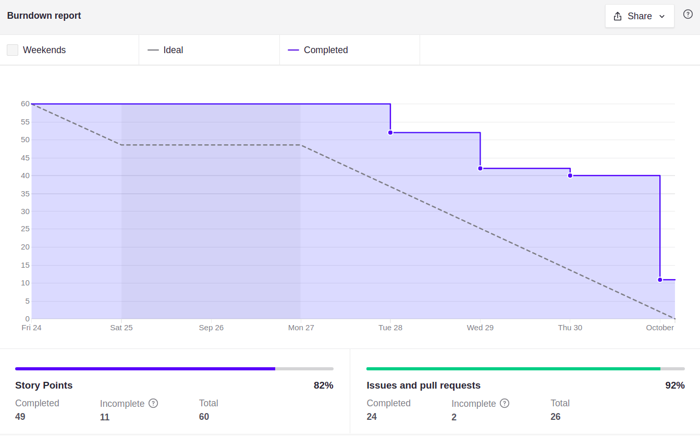

# Sprint 4

## Planejamento

**Início da sprint:** 24/09/2021

**Término da sprint:** 01/10/2021

A sprint 04 continua o trabalho na histórias de usuário, sendo a primeira sprint a ser realizada com início e fim em uma sexta-feira, como fruto das decisões anteriores, visando aumentar a produtividade e entrega da equipe. A Sprint contou com as seguintes issues planejadas:

| Issue                                                                                     | Tipo | Descrição                                                                  | Responsáveis                   |
| ----------------------------------------------------------------------------------------- | ---- | -------------------------------------------------------------------------- | ------------------------------ |
| [#87](https://github.com/fga-eps-mds/2021.1-Cartografia-social-docs/issues/87)            | Doc  | [DOCS] Atualizar documentação de Branches e Issues                         | Alexandre                      |
| [#88](https://github.com/fga-eps-mds/2021.1-Cartografia-social-docs/issues/88)            | Doc  | [DOCS] Documentar execução dos Ambientes no README                         | Alexandre                      |
| [#90](https://github.com/fga-eps-mds/2021.1-Cartografia-social-docs/issues/90)            | Doc  | [DOCS] Registrar mudança na História de Usuário 35                         | Alexandre                      |
| [#29](https://github.com/fga-eps-mds/2021.1-Cartografia-social-front/issues/29)           | Feat | [DOCS] Documentar execução dos Ambientes no README                         | Guilherme Deusdará             |
| [#32](https://github.com/fga-eps-mds/2021.1-Cartografia-social-front/issues/32)           | Doc  | [US07] Habilitar demarcação da área no Mapa                                | Alexandre e Guilherme Deusdará |
| [#34](https://github.com/fga-eps-mds/2021.1-Cartografia-social-docs/issues/34)            | Doc  | [DOCS] Atualizar documentação de Branches, Issues e Pull Requests          | Alexandre                      |
| [#34](https://github.com/fga-eps-mds/2021.1-Cartografia-social-api-gateway/issues/34)     | Feat | [US26] Integração da Mídia Adicionada com Ponto do Mapa                    | Leonardo e Guilherme Guy       |
| [#35](https://github.com/fga-eps-mds/2021.1-Cartografia-social-api-gateway/issues/35)     | Doc  | [DOCS] Atualizar documentação de Branches, Issues e Pull Requests          | Alexandre                      |
| [#15](https://github.com/fga-eps-mds/2021.1-Cartografia-social-api-mapas/issues/15)       | Doc  | [US26] Integração da Mídia Adicionada com Ponto do Mapa                    | Leonardo e Guilherme Guy       |
| [#16](https://github.com/fga-eps-mds/2021.1-Cartografia-social-api-mapas/issues/16)       | Doc  | [DOCS] Atualizar documentação de Branches, Issues e Pull Requests          | Alexandre                      |
| [#13](https://github.com/fga-eps-mds/2021.1-Cartografia-social-api-midia/issues/13)       | Doc  | [DOCS] Documentar execução dos Ambientes no README                         | Arthur                         |
| [#14](https://github.com/fga-eps-mds/2021.1-Cartografia-social-api-midia/issues/14)       | Doc  | [DOCS] Atualizar documentação de Branches, Issues e Pull Requests          | Alexandre                      |
| [#19](https://github.com/fga-eps-mds/2021.1-Cartografia-social-api-comunidades/issues/19) | Doc  | [DOCS] Documentar execução dos Ambientes no README                         | Arthur                         |
| [#20](https://github.com/fga-eps-mds/2021.1-Cartografia-social-api-comunidades/issues/20) | Doc  | [DOCS] Atualizar documentação de Branches, Issues e Pull Requests Requests | Alexandre                      |
| [#11](https://github.com/fga-eps-mds/2021.1-Cartografia-social-api-users/issues/11)       | Doc  | [DOCS] Documentar execução dos Ambientes no README                         | Arthur                         |
| [#12](https://github.com/fga-eps-mds/2021.1-Cartografia-social-api-users/issues/12)       | Doc  | [DOCS] Atualizar documentação de Branches, Issues e Pull Requests          | Alexandre                      |
| [#31](https://github.com/fga-eps-mds/2021.1-cartografia-social-api-gateway/issues/31)     | Feat | [US07] Estruturar módulo de Demarcação de Área no Serviço                  | Elias e Lorrany                |
| [#34](https://github.com/fga-eps-mds/2021.1-cartografia-social-api-gateway/issues/34)     | Feat | [US26] Integração da Mídia Adicionada com Ponto do Mapa                    | Guilherme Guy e Leonardo       |
| [#12](https://github.com/fga-eps-mds/2021.1-cartografia-social-api-mapas/issues/12)       | Feat | [US07] Estruturar módulo de Demarcação de Área                             | Elias e Lorrany                |
| [#15](https://github.com/fga-eps-mds/2021.1-cartografia-social-api-mapas/issues/15)       | Feat | [US26] Integração da Mídia Adicionada com Ponto do Mapa                    | Guilherme Guy e Leonardo       |
| [#85](https://github.com/fga-eps-mds/2021.1-cartografia-social-docs/issues/85)            | Doc  | [DOCS] Documentar Sprint 03                                                | Guilherme Guy                  |
| [#90](https://github.com/fga-eps-mds/2021.1-Cartografia-social-docs/issues/90)            | Doc  | [DOCS] Registrar mudança na História de Usuário 35                         | Alexandre                      |
| [#20](https://github.com/fga-eps-mds/2021.1-Cartografia-social-front/issues/20)           | CI   | [DEVOPS] Arrumar testes do front                                           | Marco e Alexandre             |
| [#21](https://github.com/fga-eps-mds/2021.1-Cartografia-social-front/issues/21)           | Feat | [US31] Tela de áudio                                                       | Mikhaelle e Arthur             |
| [#27](https://github.com/fga-eps-mds/2021.1-Cartografia-social-front/issues/27)           | Feat | [US13] Enviar token do usuário ao backend                                  | Elias e Mikhaelle              |

## Dividas Técnicas da Sprint 03

Da Sprint 03 ficaram as seguintes issues como divida técnica para a sprint 04, por conta da dificuldade de completar alguns fluxos no desenvolvimento:

| Issue                                                                                   | Tipo | Descrição                                                            | Responsáveis        |
| --------------------------------------------------------------------------------------- | ---- | -------------------------------------------------------------------- | ------------------- |
| [#16](https://github.com/fga-eps-mds/2021.1-Cartografia-social-api-comunidades/issues/16) | Feat   | [US19] Adição de membro administrador                                | Arthur e Marco       |
| [#27](https://github.com/fga-eps-mds/2021.1-Cartografia-social-api-gateway/issues/27)     | Feat   | [US19] Integrar gateway com serviços para definição de administrador | Arthur, Marco       |
| [#20](https://github.com/fga-eps-mds/2021.1-Cartografia-social-front/issues/20)           | CI     | [DEVOPS] Arrumar testes do front                                     | Marco, Alexandre    |
| [#21](https://github.com/fga-eps-mds/2021.1-Cartografia-social-front/issues/21)           | Feat   | [US31] Tela de áudio                                                 | Mikha, Arthur       |

As dividas técnicas da Sprint 03 foram concluídas.

### **Papéis**

Se deu sequência à rotação do papel de scrum master, com auxílio do scrum anterior para algumas orientações 

**Scrum master:** Alexandre Miguel

### **Outros pontos abordados**

Outros pontos também foram abordados durante a reunião de planejamento, dentre eles:

- Realizar a verificação das questões acerca do deploy a ser realizado com a equipe da cartografia social
- Marcar a reunião de acompanhamento dos aspectos gerais da disciplina

## **Fechamento**

Durante a reunião foi percebido que o grupo conseguiu concluir todos os pontos propostos, ainda que sentindo que o ritmo de trabalho foi mais intenso e acelerado, fazendo necessário reduzir a pontuação geral dos backlog para adequar melhor as próximas sprints à realidade do desenvolvimento do projeto.

### Burndown

### **Dívidas técnicas**

Todas as issues foram realizadas nessa sprint, não gerando dívidas técnicas.

### **Quadro de pareamentos**

<iframe width="800" height="470" src="https://docs.google.com/spreadsheets/d/e/2PACX-1vTLHE3O8zIRwIz41POb4DXlbyhoVHY9R9vC0wSL-60NMeFVH0Fk0wqUV2v8AgRGTokYaZmwunInbF3m/pubhtml?gid=1870592004&amp;single=true&amp;widget=true&amp;headers=false"></iframe>

### **Quadro de conhecimentos**

Conforme documento de [métricas de conhecimento](./metricas/quadro-de-conhecimentos)

### **Observações, comentários e melhorias possíveis**

Conforme discutido no fechamento da sprint, foram feitas modificações na agenda de trabalho das sprints para melhor acomodar ao ritmo da equipe.

## **Versionamento de edições desta página**

---

| Data       | Autor         | Descrição                | Versão |
| ---------- | ------------- | ------------------------ | ------ |
| 01/10/2021 | Alexandre Miguel | Criação do documento     | 0.1    |
| 08/11/2021 | Alexandre Miguel | Atualização do documento com transcrição do registro inicial para Markdown | 0.2    |
| 08/11/2021 | Alexandre Miguel | Finalização do documento | 1.0    |
