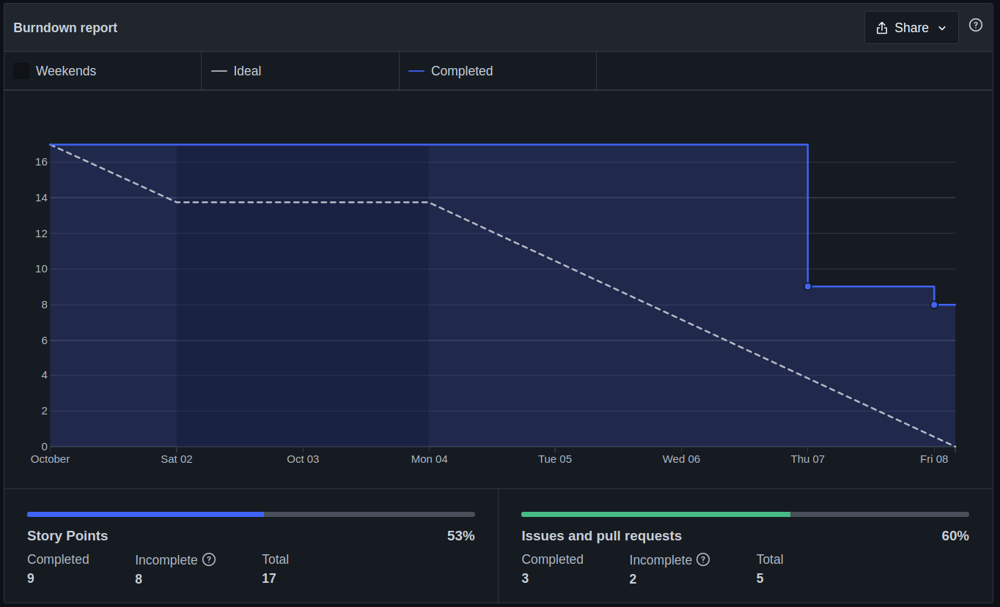
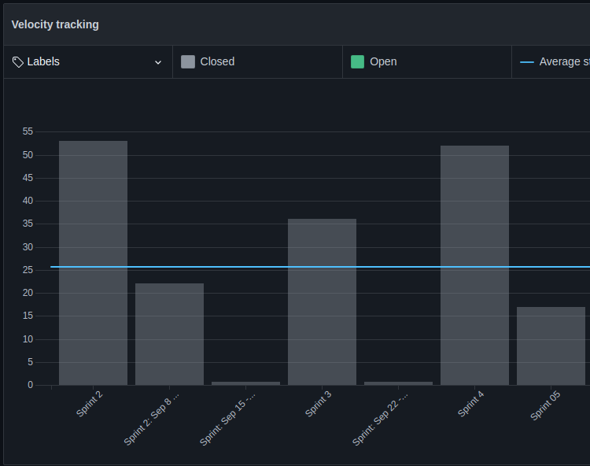

# Sprint 5

## Planejamento

__Início da sprint:__ 01/10/2021

__Término da sprint:__ 08/10/2021

A sprint 05 continua o trabalho na histórias de usuário, e foca também na continuação de histórias já começadas por outras issues. Com as seguintes issues planejadas:

| Issue                                                                                     | Tipo   | Descrição                                                            | Serviço|Responsáveis        |
| ----------------------------------------------------------------------------------------- |---- | ------ | -------------------------------------------------------------------- | ------------------- |
| [#40](https://github.com/fga-eps-mds/2021.1-cartografia-social-api-gateway/issues/40) | Feat   | [US22] Alterações no esquema das questões    | Gateway   | Guilherme Guy e Mikhaelle       |
| [#24](https://github.com/fga-eps-mds/2021.1-cartografia-social-api-comunidades/issues/24) | Feat   | [US22] Alterações no esquema das questões    | Comunidades   | Guilherme Guy e Mikhaelle       |
| [#42](https://github.com/fga-eps-mds/2021.1-cartografia-social-front/issues/42) | Feat   | [US13] Recuperação de senha                              | Frontend | Alexandre e Elias       |
| [#43](https://github.com/fga-eps-mds/2021.1-cartografia-social-front/issues/43) | Feat   | [US21] Upload de multimídias | Frontend| Guilherme Deusdará e Lorrany       |
| [#45](https://github.com/fga-eps-mds/2021.1-cartografia-social-front/issues/45) | Feat   | [US02] Visualizar as multimídias adicionadas | Frontend  | Arthur, Leonardo e Marco       |
| [#46](https://github.com/fga-eps-mds/2021.1-cartografia-social-front/issues/46) | Feat   | [US11] Ver ponto no mapa | Frontend| Arthur, Leonardo e Marco       |

## Dividas Técnicas da Sprint 04

Não houveram 

### Papéis

 Se deu sequencia a rotação do papel de scrum master. Lembrando que o scrum master irá rotacionar por sprint/semana, sendo que o SM anterior irá ajudar o novo, pareando e distribuindo o conhecimento dessa forma.

__Scrum master:__ [Arthur Rodrigues](https://github.com/arthurarp)

### Outros pontos abordados

 Outros pontos também foram abordados durante a reunião de planejamento, dentre eles:

- Alteração no horário das reuniões com a cliente. De 20:20 para as 20:00.
- Reconhecimento das limitações do grupo a respeito da entrega do escopo total e realizar o alinhamento de expectativas com a professora Sheilla.
- Geração das releases minors

## Fechamento

 Após a mudança de data do fechamento da sprint, percebemos que até então não houveram muitas mudanças a respeito da produtividade do time. Ficou combinado para o time que iriamos, nas próximas sprints, repensar melhor na quantidade de pontos escolhidos para novas sprints. Na sprint algumas histórias de usuários acabaram virando dívida técnica que afeta na organização do time e no planejamento da próxima sprint.

### Burndown

### Velocity

### Dívidas técnicas

As seguintes issues se tornaram dívidas técnicas para a Sprint 06:

| Issue                                                                                     | Pontuação   | Descrição                                                            | Serviço|Responsáveis        |
| ----------------------------------------------------------------------------------------- |---- | ------ | -------------------------------------------------------------------- | ------------------- |
| [#45](https://github.com/fga-eps-mds/2021.1-cartografia-social-front/issues/45) | 05   | [US02] Visualizar as multimídias adicionadas | Frontend  | Arthur, Leonardo e Marco       |
| [#46](https://github.com/fga-eps-mds/2021.1-cartografia-social-front/issues/46) | 03   | [US11] Ver ponto no mapa | Frontend| Arthur, Leonardo e Marco       |

### Quadro de pareamentos

<iframe width="800" height="320" src="https://docs.google.com/spreadsheets/d/e/2PACX-1vTLHE3O8zIRwIz41POb4DXlbyhoVHY9R9vC0wSL-60NMeFVH0Fk0wqUV2v8AgRGTokYaZmwunInbF3m/pubhtml?gid=1763221063&amp;single=true&amp;widget=true&amp;headers=false"></iframe>

### Quadro de conhecimentos

Conforme documento de [métricas de conhecimento](./metricas/quadro-de-conhecimentos)

### Observações, comentários e melhorias possíveis

 A partir dessa sprint, focar em melhorar as funcionalidades já implementadas para garantir uma melhor qualidade no produto final.

## Versionamento de edições desta página
---

| Data       | Autor         | Descrição                | Versão |
| ---------- | ------------- | ------------------------ | ------ |
| 26/10/2021 | Arthur Rodrigues | Criação do documento     | 0.1    |
| 26/10/2021 | Arthur Rodrigues | Adição das métricas     | 1.0    |
