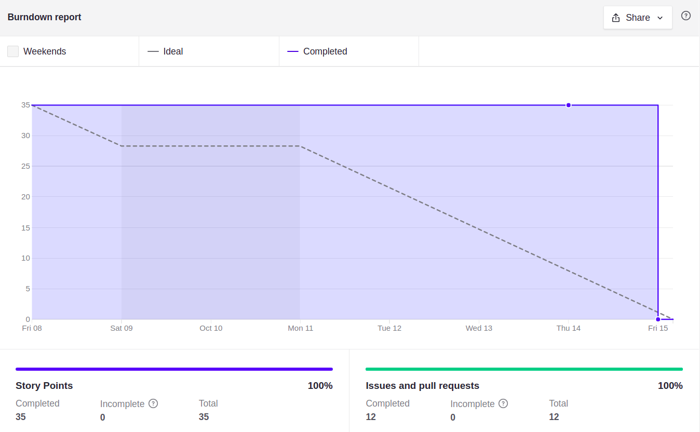

# Sprint 6

## Planejamento

**Início da sprint:** 08/10/2021

**Término da sprint:** 15/10/2021

A sprint 06 continua o trabalho na histórias de usuário. Com as seguintes issues planejadas:

| Issue                                                                                     | Tipo    | Descrição                                              | Responsáveis             |
| ----------------------------------------------------------------------------------------- | ------- | ------------------------------------------------------ | ------------------------ |
| [#26](https://github.com/fga-eps-mds/2021.1-Cartografia-social-api-comunidades/issues/26) | Feat    | [US01] Marcar ponto no mapa                            | Guilherme Guy e Leonardo |
| [#27](https://github.com/fga-eps-mds/2021.1-Cartografia-social-api-comunidades/issues/27) | Improve | [IMPROVE] Integração serviços                          | Elias e Leonardo         |
| [#42](https://github.com/fga-eps-mds/2021.1-Cartografia-social-api-gateway/issues/42)     | Feat    | [US01] Marcar ponto no mapa                            | Guilherme Guy e Leonardo |
| [#43](https://github.com/fga-eps-mds/2021.1-Cartografia-social-api-gateway/issues/43)     | Improve    | [IMPROVE] Integração serviços                          | Elias e Leonardo         |
| [#44](https://github.com/fga-eps-mds/2021.1-Cartografia-social-api-gateway/issues/44)     | Improve    | [IMPROVE] Marcar ponto no mapa                         | Guilherme Guy e Leonardo |
| [#20](https://github.com/fga-eps-mds/2021.1-Cartografia-social-api-mapas/issues/20)       | Improve    | [IMPROVE] Integração serviços                          | Elias e Leonardo         |
| [#21](https://github.com/fga-eps-mds/2021.1-Cartografia-social-api-mapas/issues/21)       | Feat    | [US01] Marcar ponto no mapa                            | Guilherme Guy e Leonardo |
| [#15](https://github.com/fga-eps-mds/2021.1-Cartografia-social-api-users/issues/15)       | Improve    | [IMPROVE] Integração serviços                          | Elias e Leonardo         |
| [#16](https://github.com/fga-eps-mds/2021.1-Cartografia-social-api-users/issues/16)       | Improve    | [IMPROVE] Criar usuarios                               | Elias e Leonardo         |
| [#46](https://github.com/fga-eps-mds/2021.1-Cartografia-social-front/issues/46)           | Feat    | [US11] Ver ponto no mapa                               | Leonardo, Arthur e Marco |
| [#50](https://github.com/fga-eps-mds/2021.1-Cartografia-social-front/issues/50)           | Feat    | [US22] Solicitar apoio da equipe da cartografia social | Mikhaelle e Marco        |
| [#51](https://github.com/fga-eps-mds/2021.1-Cartografia-social-front/issues/51)           | Feat    | [US01] Marcar ponto no mapa                            | Mikhaelle e Marco        |
| [#93](https://github.com/fga-eps-mds/2021.1-Cartografia-social-docs/issues/93)           | Docs    | [DOCS] Documentar Agile EVM                             | Alexandre e Lorrany        |

## Dividas Técnicas da Sprint 05

Da Sprint 05 ficaram as seguintes issues como divida técnica para a sprint 06.

| Issue | Pontuação | História de Usuário | Serviço | Responsáveis |
| --- | --- | --- | --- | ---|
| [#45](https://github.com/fga-eps-mds/2021.1-cartografia-social-front/issues/45) | 05   | [US02] Visualizar as multimídias adicionadas | Frontend  | Arthur, Leonardo e Marco       |
| [#46](https://github.com/fga-eps-mds/2021.1-cartografia-social-front/issues/46) | 03   | [US11] Ver ponto no mapa | Frontend| Arthur, Leonardo e Marco       |

As dividas técnicas da Sprint 05 foram concluídas.

### Papéis

Se deu sequencia a rotação do papel de scrum master. Lembrando que o scrum master irá rotacionar por sprint/semana, sendo que o SM anterior irá ajudar o novo, pareando e distribuindo o conhecimento dessa forma.

**Scrum master:** Leonardo dos Santos

### Outros pontos abordados

Dentre os pontos abordados, foi percebida a necessidade do esforço conjunto e foco em integração dos fluxos desenvolvidos, existentes nos serviços de backend mas ainda a serem implementados no serviço do frontend, sendo feita a priorização dessa integração em relação à adição de novos fluxos, como os que contemplassem regras elaboradas de acesso a dados ou disponibilidade offline.

## Fechamento

Durante a reunião de fechamento foi percebido o avanço da equipe nas issues desenvolvidas 

### Burndown

### **Dívidas técnicas**

Todas as issues definidas para a sprint anterior foram finalizadas

### Quadro de pareamentos

<iframe width="800" height="470" src="https://docs.google.com/spreadsheets/d/e/2PACX-1vTLHE3O8zIRwIz41POb4DXlbyhoVHY9R9vC0wSL-60NMeFVH0Fk0wqUV2v8AgRGTokYaZmwunInbF3m/pubhtml?gid=1455931092&amp;single=true&amp;widget=true&amp;headers=false"></iframe>

### Quadro de conhecimentos

Conforme documento de [métricas de conhecimento](./metricas/quadro-de-conhecimentos)

### Observações, comentários e melhorias possíveis

Conforme discutido no fechamento da sprint, foram feitas modificações na agenda de trabalho das sprints para melhor acomodar ao ritmo da equipe, priorizando fluxos de integração, ainda realizando e priorizando histórias de usuário cruciais para o funcionamento do produto.

## Versionamento de edições desta página

---

| Data       | Autor         | Descrição                | Versão |
| ---------- | ------------- | ------------------------ | ------ |
| 15/10/2021 | Leonardo dos Santos | Criação do documento     | 0.1    |
| 08/11/2021 | Alexandre Miguel | Atualização do documento com transcrição do registro inicial para Markdown | 0.2    |
| 08/11/2021 | Alexandre Miguel | Finalização do documento | 1.0    |
