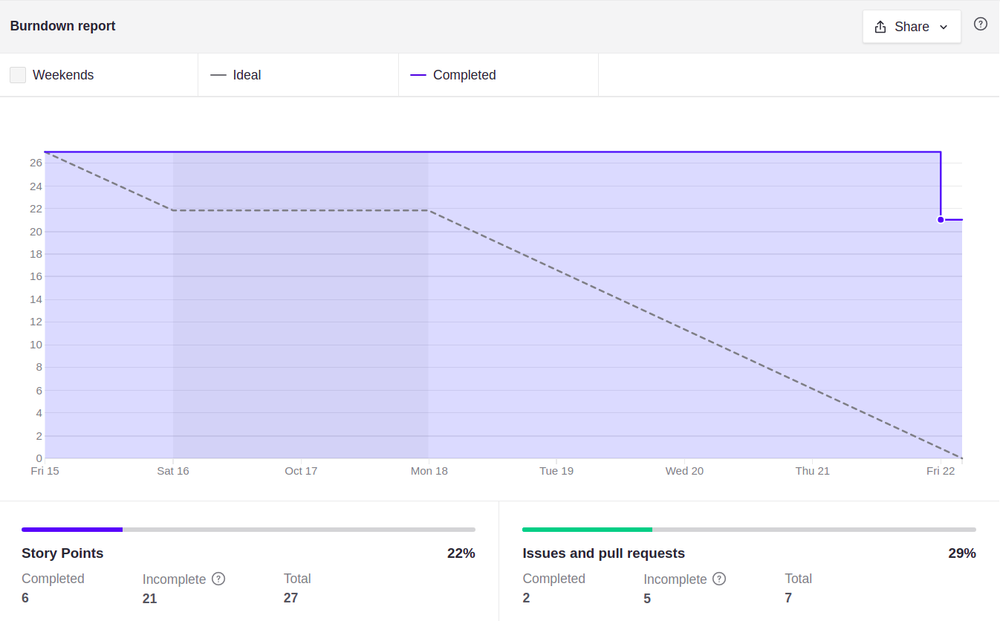

# Sprint 7

## Planejamento

__Início da sprint:__ 15/10/2021

__Término da sprint:__ 22/10/2021

A sprint 07 continua o trabalho na histórias de usuário. Com as seguintes issues planejadas:

| Issue | Tipo | Descrição | Responsáveis |
| --- | --- | --- | ---|
| [#57](https://github.com/fga-eps-mds/2021.1-Cartografia-social-front/issues/57) | Feat | [US01] Editar ponto/area | Mikhaelle e Marco |
| [#31](https://github.com/fga-eps-mds/2021.1-Cartografia-social-api-comunidades/issues/31) | Feat | [US37] Listagem de usuários sem comunidade | Elias e Leonardo |
| [#48](https://github.com/fga-eps-mds/2021.1-Cartografia-social-api-gateway/issues/48) | Feat | [US15] permitir que apenas um pesquisador possa criar uma comunidade | Leonardo e Lorrany |
| [#30](https://github.com/fga-eps-mds/2021.1-Cartografia-social-api-comunidades/issues/30) | Feat | [US24] exportar dados para o formato KML para os pontos/área | Guilherme Guy, Leonardo e Alexandre |
| [#47](https://github.com/fga-eps-mds/2021.1-Cartografia-social-api-gateway/issues/47) | Feat | [US24] exportar dados para o formato KML para os pontos/área | Guilherme Guy, Leonardo e Alexandre |
| [#24](https://github.com/fga-eps-mds/2021.1-Cartografia-social-api-mapas/issues/24) | Feat | [US24] exportar dados para o formato KML para os pontos/área | Guilherme Guy |
| [#56](https://github.com/fga-eps-mds/2021.1-Cartografia-social-front/issues/56) | Feat | [US37] Tela de criação de comunidade | Guilherme Deusdará e Arthur |

## Dividas Técnicas da Sprint 06

Não houveram.

### Papéis

Se deu sequencia a rotação do papel de scrum master. Lembrando que o scrum master irá rotacionar por sprint/semana, sendo que o SM anterior irá ajudar o novo, pareando e distribuindo o conhecimento dessa forma.

__Scrum master:__ Guilherme Deusdará

### Outros pontos abordados

Outros pontos também foram abordados durante a reunião de planejamento, dentre eles:

- A Retomada do foco em issues de desenvolvimento de novas funcionalidades, em relação às recentes integrações, para agregar mais funcionalidades no produto

## Fechamento

Foi notado pela equipe que a não completude das tarefas não ocorreu como esperado, haviam funcionalidades a serem polidas e testadas. Ao final da sprint, foi liberada a primeira release major para uso dos stakeholders.

### Burndown

### Dívidas técnicas

As seguintes issues se tornaram dívidas técnicas para a Sprint 08:

| Issue | Tipo | Descrição | Serviço | Responsáveis |
| ----- | ---- | --------- | ------- | ------------ |
| [#57](https://github.com/fga-eps-mds/2021.1-Cartografia-social-front/issues/57) | Feat   | [US01] Editar ponto/area    | Frontend  | Marco Antônio e Mikhaelle       |
| [#47](https://github.com/fga-eps-mds/2021.1-Cartografia-social-api-gateway/issues/47) | Feat   | [US26] exportar dados para o formato KML para os pontos/área    | Gateway   | Guilherme Guy, Leonardo e Alexandre       |
| [#56](https://github.com/fga-eps-mds/2021.1-Cartografia-social-front/issues/56) | Feat   | [US37] Tela de criação de comunidade | Frontend | Arthur e Guilherme Deusdará       |

### Quadro de pareamentos

<iframe width="800" height="470" src="https://docs.google.com/spreadsheets/d/e/2PACX-1vTLHE3O8zIRwIz41POb4DXlbyhoVHY9R9vC0wSL-60NMeFVH0Fk0wqUV2v8AgRGTokYaZmwunInbF3m/pubhtml?gid=998911463&amp;single=true&amp;widget=true&amp;headers=false"></iframe>

### Quadro de conhecimentos

Conforme documento de [métricas de conhecimento](./metricas/quadro-de-conhecimentos)

### Observações, comentários e melhorias possíveis

Conforme discutido no fechamento da sprint, foram feitas modificações na agenda de trabalho das sprints para melhor acomodar ao ritmo da equipe.

## Versionamento de edições desta página
---

| Data       | Autor         | Descrição                | Versão |
| ---------- | ------------- | ------------------------ | ------ |
| 15/10/2021 | Guilherme Deusdará | Criação do documento     | 0.1    |
| 08/11/2021 | Alexandre Miguel | Atualização do documento com transcrição do registro inicial para Markdown | 0.2    |
| 08/11/2021 | Alexandre Miguel | Finalização do documento | 1.0    |