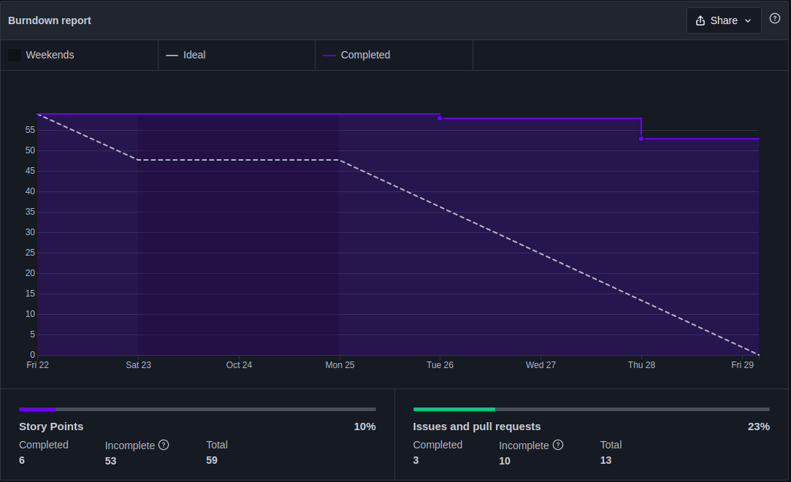
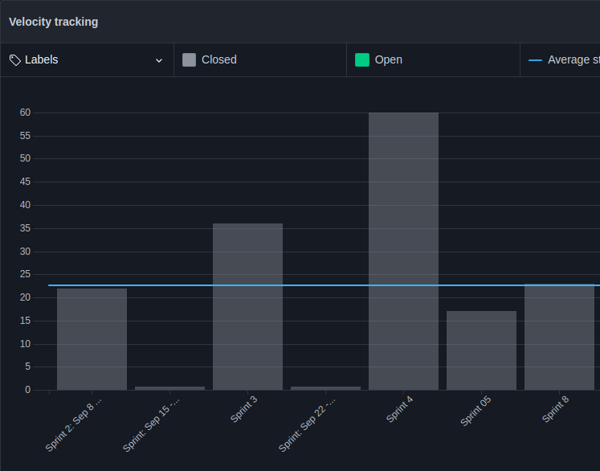

# Sprint 8

## Planejamento

__Início da sprint:__ 22/10/2021

__Término da sprint:__ 29/10/2021

A sprint 08 se concentra em resolver dívidas passadas, desenvolvimento de melhorias, correção de bugs e criação de novas histórias de usuário para atender demandas do cliente. Foi decidido também, que esse seria o último planejamento de sprint, por isso foi feito levantamento para 2 semanas de trabalho. As issues planejadas para essa sprint foram as seguintes:

| Issue | Tipo | Descrição | Serviço | Responsáveis |
| ----- | ---- | --------- | ------- | ------------ |
| [#60](https://github.com/fga-eps-mds/2021.1-Cartografia-social-front/issues/60) | Improve | [IMPROVE] Adicionar botão de sair no side menu |  Frontend  | Lorrany e Guilherme Deusdará   |
| [#61](https://github.com/fga-eps-mds/2021.1-Cartografia-social-front/issues/61) | Improve | [IMPROVE] Adicionar ícone do perfil |  Frontend  | Lorrany e Guilherme Deusdará   |
| [#62](https://github.com/fga-eps-mds/2021.1-Cartografia-social-front/issues/62) | Improve | [IMPROVE] Retirar ícones que não tem funcionalidades implementadas |  Frontend  | Lorrany                        |
| [#63](https://github.com/fga-eps-mds/2021.1-Cartografia-social-front/issues/63) | Improve | [IMPROVE] Tratar mensagens de erros |  Frontend  | Mikhaelle                      |
| [#64](https://github.com/fga-eps-mds/2021.1-Cartografia-social-front/issues/64) | Improve | [IMPROVE] Melhorar interface de apresentação das informações do ponto |  Frontend  | Marco Antônio                  |
| [#55](https://github.com/fga-eps-mds/2021.1-Cartografia-social-api-gateway/issues/55) | Improve | [IMPROVE] Permitir que usuário da comunidade use o endpoint getUserByEmail |  Gateway   | Elias e Guilherme Guy          |
| [#69](https://github.com/fga-eps-mds/2021.1-Cartografia-social-front/issues/69) | HotFix  | [BUG] Corrigir bug do formulário |  Frontend  | Mikhaelle e Guilherme Deusdará |
| [#65](https://github.com/fga-eps-mds/2021.1-Cartografia-social-front/issues/65) | HotFix  | [BUG] Foto/Video da galeria está dando erro |  Frontend  | Arthur                         |
| [#66](https://github.com/fga-eps-mds/2021.1-Cartografia-social-front/issues/66) | HotFix  | [BUG] Extensão da imagem dando erro na thumb |  Frontend  | Arthur e Mikhaelle             |
| [#67](https://github.com/fga-eps-mds/2021.1-Cartografia-social-front/issues/67) | Feat    | [US01] Excluir ponto |  Frontend  | Lorrany e Marco Antônio        |
| [#54](https://github.com/fga-eps-mds/2021.1-Cartografia-social-api-gateway/issues/54) | Feat    | [US01] Excluir ponto |  Gateway   | Elias e Leonardo               |
| [#68](https://github.com/fga-eps-mds/2021.1-Cartografia-social-front/issues/68) | Feat    | [US11] Pegar pontos pela api |  Frontend  | Arthur e Guilherme Deusdará    |
| [#95](https://github.com/fga-eps-mds/2021.1-Cartografia-social-docs/issues/95) | Doc    | [DOCS] Documentação das métricas do SonarQube |  Docs  | Lorrany, Alexandre e Guilherme Guy    |

## Dividas Técnicas da Sprint 07

Da Sprint 07 ficaram as seguintes issues como divida técnica para a sprint 08.

| Issue | Tipo | Descrição | Serviço | Responsáveis |
| ----- | ---- | --------- | ------- | ------------ |
| [#57](https://github.com/fga-eps-mds/2021.1-Cartografia-social-front/issues/57) | Feat   | [US01] Editar ponto/area    | Frontend  | Marco Antônio e Mikhaelle       |
| [#47](https://github.com/fga-eps-mds/2021.1-Cartografia-social-api-gateway/issues/47) | Feat   | [US26] exportar dados para o formato KML para os pontos/área    | Gateway   | Guilherme Guy, Leonardo e Alexandre       |
|  | Feat   | []                              | Frontend | Arthur e Guilherme Deusdará       |

Das dividas técnicas da Sprint 07, apenas a [[US26] exportar dados para o formato KML para os pontos/área foram concluídas]() foi concluída.

### Papéis

 Se deu sequencia a rotação do papel de scrum master. Lembrando que o scrum master irá rotacionar por sprint/semana, sendo que o SM anterior irá ajudar o novo, pareando e distribuindo o conhecimento dessa forma.

__Scrum master:__ [Marco Antônio](https://github.com/markinlimac)

### Outros pontos abordados

 Outros pontos também foram abordados durante a reunião de planejamento, dentre eles:

- Alteração no escopo do MVP para adicionar funcionalidades importantes para a cliente.

## Fechamento

 Na sprint algumas histórias de usuários acabaram virando dívida técnica, porém como foi planejado trabalho para duas semanas essas dívida ja eram esperadas para serem finalizadas na próxima sprint.

### Burndown

### Velocity

### Dívidas técnicas

As seguintes issues se tornaram dívidas técnicas para a Sprint 09:

| Issue | Pontuação | Descrição | Serviço | Responsáveis |
| ----- | --------- | --------- | ------- | ------------ |
| [#54](https://github.com/fga-eps-mds/2021.1-Cartografia-social-api-gateway/issues/54) | 03   | [US01] Excluir ponto | Gateway   | Elias e Leonardo     |
| [#55](https://github.com/fga-eps-mds/2021.1-Cartografia-social-api-gateway/issues/55) | 01 | [IMPROVE] Permitir que usuário da comunidade use o endpoint getUserByEmail |  Gateway   | Elias e Guilherme Guy          |
| [#95](https://github.com/fga-eps-mds/2021.1-Cartografia-social-docs/issues/95) | 21    | [DOCS] Documentação das métricas do SonarQube |  Docs  | Lorrany, Alexandre e Guilherme Guy    |
| [#67](https://github.com/fga-eps-mds/2021.1-Cartografia-social-front/issues/67) | 03    | [US01] Excluir ponto |  Frontend  | Lorrany e Marco Antônio        |
| [#68](https://github.com/fga-eps-mds/2021.1-Cartografia-social-front/issues/68) | 08    | [US11] Pegar pontos pela api |  Frontend  | Arthur e Guilherme Deusdará    |

### Quadro de pareamentos

<iframe width="800" height="320" src="https://docs.google.com/spreadsheets/d/e/2PACX-1vTLHE3O8zIRwIz41POb4DXlbyhoVHY9R9vC0wSL-60NMeFVH0Fk0wqUV2v8AgRGTokYaZmwunInbF3m/pubhtml?gid=215824160&amp;single=true&amp;widget=true&amp;headers=false"></iframe>

### Quadro de conhecimentos

Conforme documento de [métricas de conhecimento](./metricas/quadro-de-conhecimentos)

## Versionamento de edições desta página
---

| Data       | Autor         | Descrição                | Versão |
| ---------- | ------------- | ------------------------ | ------ |
| 01/11/2021 | Marco Antônio | Criação do documento     | 0.1    |
| 01/11/2021 | Marco Antônio | Adição das métricas      | 1.0    |