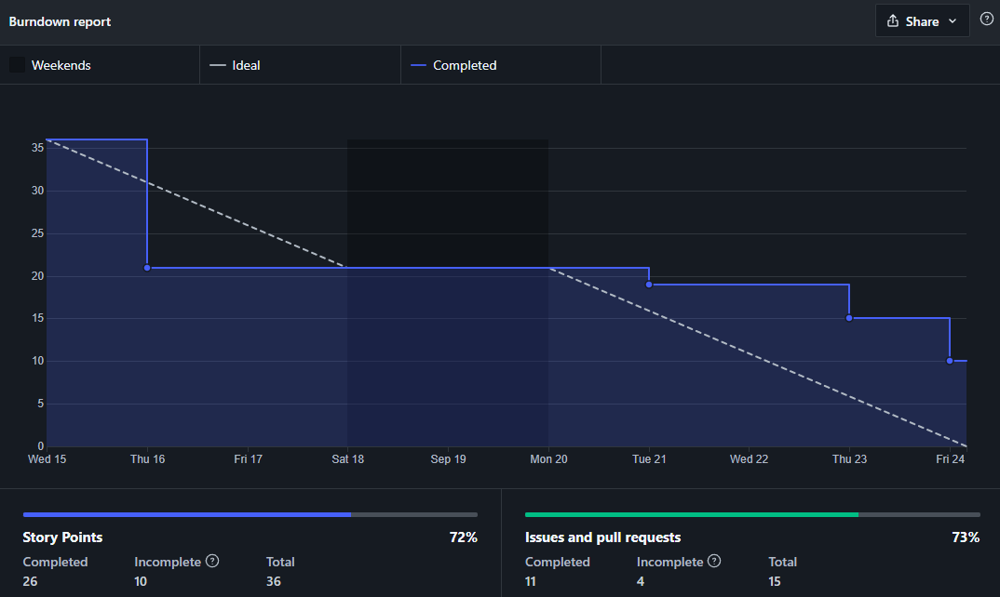
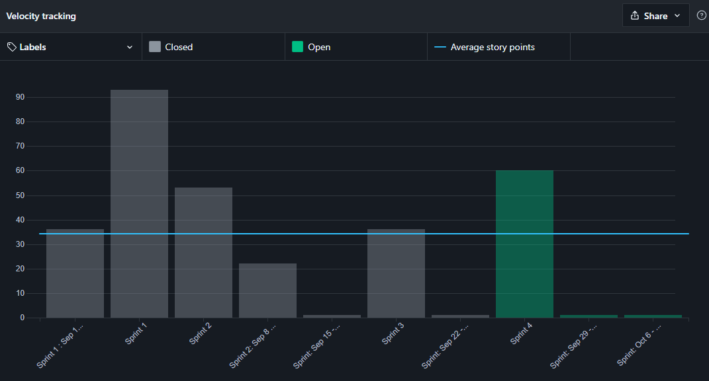

# Sprint 1

## Planejamento

__Início da sprint:__ 29/10/2021

__Término da sprint:__ 05/11/2021

A sprint 03 continua o trabalho na histórias de usuário. Com as seguintes issues planejadas:

| Issue | Tipo | Descrição | Responsáveis |
| --- | --- | --- | ---|
| [#35](https://github.com/fga-eps-mds/2021.1-Cartografia-social-api-comunidades/issues/35) | Feat | Corrigir documentação de instalação | Marco e Leonardo |
| [#56](https://github.com/fga-eps-mds/2021.1-Cartografia-social-api-gateway/issues/56) | Feat | Corrigir documentação de instalação | Marco e Leonardo |
| [#25](https://github.com/fga-eps-mds/2021.1-Cartografia-social-api-mapas/issues/25) | Feat | Corrigir documentação de instalação | Marco e Leonardo |
| [#17](https://github.com/fga-eps-mds/2021.1-Cartografia-social-api-users/issues/17) | Feat | Corrigir documentação de instalação | Marco e Leonardo |
| [#17](https://github.com/fga-eps-mds/2021.1-Cartografia-social-api-midia/issues/17) | Feat | Corrigir documentação de instalação | Marco e Leonardo |
| [#95](https://github.com/fga-eps-mds/2021.1-Cartografia-social-docs/issues/95) | Feat | [DOCS] Documentação das métricas do SonarQube | Guilherme Guy, Lorrany e Alexandre |
| [#101](https://github.com/fga-eps-mds/2021.1-Cartografia-social-docs/issues/101) | Feat | Criar documentação de testes de usabilidade | Guilherme Guy, Mikhaelle e Alexandre |
| [#67](https://github.com/fga-eps-mds/2021.1-Cartografia-social-front/issues/67) | Feat | [US01] Excluir ponto | Marco e Lorrany |
| [#68](https://github.com/fga-eps-mds/2021.1-Cartografia-social-front/issues/68) | Feat | [US11] Pegar pontos pela api | Arthur e Guilherme Deusdará |
| [#77](https://github.com/fga-eps-mds/2021.1-Cartografia-social-front/issues/77) | Feat | Corrigir documentação de instalação do front | Marco e Leonardo |
| [#84](https://github.com/fga-eps-mds/2021.1-Cartografia-social-front/issues/84) | Feat | [ADDITIONAL] Mostrar inputs para latitude e longitude na criação de ponto e área | Gulherme Deusdará |

## Dividas Técnicas da Sprint 02

Da Sprint 02 ficaram as seguintes issues como divida técnica para a sprint 03.

| Issue                                                                                   | Tipo | Descrição                                                            | Responsáveis        |
| --------------------------------------------------------------------------------------- | ---- | -------------------------------------------------------------------- | ------------------- |
| [#9](https://github.com/fga-eps-mds/2021.1-Cartografia-social-api-comunidades/issues/9) | Doc  | [US36] Definir as questões de criação de comunidade e criar no banco | Guy, Arthur         |
| [#6](https://github.com/fga-eps-mds/2021.1-Cartografia-social-api-midia/issues/6)       | Doc  | [US21] Persistir os dados de arquivos                                | Guy, Leo, Elias     |
| [#6](https://github.com/fga-eps-mds/2021.1-Cartografia-social-api-midia/issues/6)       | Doc  | [US36] Formulário criação da comunidade dinâmico                     | Deusdará, Alexandre |

As dividas técnicas da Sprint 02 foram concluídas.

### Papéis

Se deu sequencia a rotação do papel de scrum master. Lembrando que o scrum master irá rotacionar por sprint/semana, sendo que o SM anterior irá ajudar o novo, pareando e distribuindo o conhecimento dessa forma.

__Scrum master:__ Guilherme Guy

### Outros pontos abordados

Outros pontos também foram abordados durante a reunião de planejamento, dentre eles:

- Criar regras de navegação no frontend, definir isso como critério de aceitação para as tarefas. O trabalho inicial deste direcionamento foi transformado em uma issue
- Foi decidido manter o menu hambúrguer no design do frontend

## Fechamento

Durante a reunião de fechamento foi visto que o momento de fechamento da sprint não condiz com o período produtivo da equipe, resultando na terceira sprint com dívidas técnicas. Foi feita a proposta de troca do fechamento/abertura de nova sprint para as sextas-feiras, de forma que a Sprint 03 será acrescentada de dois dias e a Sprint 04 começará sexta-feira dia 24/09 e irá até 01/10.

Mesmo assim, algumas issues não foram fechadas até o horário limite, se tornando dívidas técnicas para a Sprint 04, entretanto a maioria o trabalho estava concluído, restando apenas revisar o pull request.

### Burndown

### Velocity

> Nesta imagem devem ser ignorados os valores da Sprint 04 (ainda em progresso) e os valores registrados como "Sprint: September XX...", estes ultimos são gerados pela funcionalidade de sprints do ZenHub, que foi testada pela equipe mas substituida por milestones para realizar marcação das sprints.

### Dívidas técnicas

As seguintes issues se tornaram dívidas técnicas para a Sprint 04:
- [US19] Definição de membros administradores das comunidades
  * [Back] Adicionar membro da comunidade como administrador [2] -> Marco, Arthur
  * [Back - Gateway] Integrar com microsserviço [2] -> Marco, Arthur
- Arrumar testes do front [5] -> Marco, Alexandre
- [US31] Gravar áudio
  * [Front] Tela de gravador de áudio [5] -> Mikha, Arthur

### Quadro de pareamentos

<iframe width="800" height="470" src="https://docs.google.com/spreadsheets/d/e/2PACX-1vTLHE3O8zIRwIz41POb4DXlbyhoVHY9R9vC0wSL-60NMeFVH0Fk0wqUV2v8AgRGTokYaZmwunInbF3m/pubhtml?gid=816613624&amp;single=true&amp;widget=true&amp;headers=false"></iframe>

### Quadro de conhecimentos

Conforme documento de [métricas de conhecimento](./metricas/quadro-de-conhecimentos)

### Observações, comentários e melhorias possíveis

Conforme discutido no fechamento da sprint, foram feitas modificações na agenda de trabalho das sprints para melhor acomodar ao ritmo da equipe.

## Versionamento de edições desta página
---

| Data       | Autor         | Descrição                | Versão |
| ---------- | ------------- | ------------------------ | ------ |
| 21/09/2021 | Guilherme Guy | Criação do documento     | 0.1    |
| 26/09/2021 | Guilherme Guy | Atualização do documento | 0.2    |
| 01/10/2021 | Guilherme Guy | Finalização do documento | 1.0    |