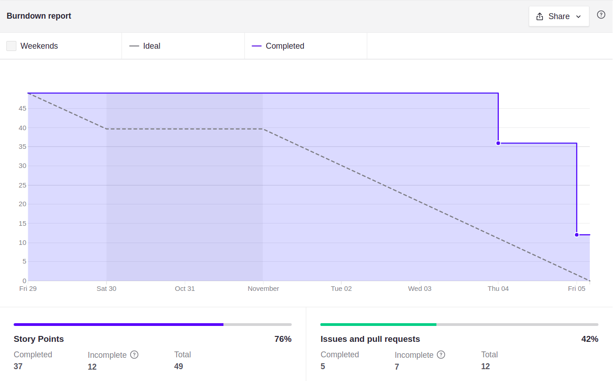

# Sprint 9

## Planejamento

__Início da sprint:__ 29/10/2021

__Término da sprint:__ 05/11/2021

A sprint 09 continua o trabalho na histórias de usuário. Com as seguintes issues planejadas:

| Issue | Tipo | Descrição | Responsáveis |
| --- | --- | --- | ---|
| [#35](https://github.com/fga-eps-mds/2021.1-Cartografia-social-api-comunidades/issues/35) | Fix | Corrigir documentação de instalação | Marco e Leonardo |
| [#56](https://github.com/fga-eps-mds/2021.1-Cartografia-social-api-gateway/issues/56) | Fix | Corrigir documentação de instalação | Marco e Leonardo |
| [#25](https://github.com/fga-eps-mds/2021.1-Cartografia-social-api-mapas/issues/25) | Fix | Corrigir documentação de instalação | Marco e Leonardo |
| [#17](https://github.com/fga-eps-mds/2021.1-Cartografia-social-api-users/issues/17) | Fix | Corrigir documentação de instalação | Marco e Leonardo |
| [#17](https://github.com/fga-eps-mds/2021.1-Cartografia-social-api-midia/issues/17) | Fix | Corrigir documentação de instalação | Marco e Leonardo |
| [#95](https://github.com/fga-eps-mds/2021.1-Cartografia-social-docs/issues/95) | Docs | [DOCS] Documentação das métricas do SonarQube | Guilherme Guy, Lorrany e Alexandre |
| [#101](https://github.com/fga-eps-mds/2021.1-Cartografia-social-docs/issues/101) | Docs | Criar documentação de testes de usabilidade | Guilherme Guy, Mikhaelle e Alexandre |
| [#67](https://github.com/fga-eps-mds/2021.1-Cartografia-social-front/issues/67) | Feat | [US01] Excluir ponto | Marco e Lorrany |
| [#68](https://github.com/fga-eps-mds/2021.1-Cartografia-social-front/issues/68) | Feat | [US11] Pegar pontos pela api | Arthur e Guilherme Deusdará |
| [#77](https://github.com/fga-eps-mds/2021.1-Cartografia-social-front/issues/77) | Fix | Corrigir documentação de instalação do front | Marco e Leonardo |
| [#84](https://github.com/fga-eps-mds/2021.1-Cartografia-social-front/issues/84) | Improve | [ADDITIONAL] Mostrar inputs para latitude e longitude na criação de ponto e área | Gulherme Deusdará |

## Dividas Técnicas da Sprint 08

Da Sprint 08 ficaram as seguintes issues como divida técnica para a sprint 09.

| Issue | Pontuação | Descrição | Serviço | Responsáveis |
| ----- | --------- | --------- | ------- | ------------ |
| [#54](https://github.com/fga-eps-mds/2021.1-Cartografia-social-api-gateway/issues/54) | 03   | [US01] Excluir ponto | Gateway   | Elias e Leonardo     |
| [#55](https://github.com/fga-eps-mds/2021.1-Cartografia-social-api-gateway/issues/55) | 01 | [IMPROVE] Permitir que usuário da comunidade use o endpoint getUserByEmail |  Gateway   | Elias e Guilherme Guy          |
| [#95](https://github.com/fga-eps-mds/2021.1-Cartografia-social-docs/issues/95) | 21    | [DOCS] Documentação das métricas do SonarQube |  Docs  | Lorrany, Alexandre e Guilherme Guy    |
| [#67](https://github.com/fga-eps-mds/2021.1-Cartografia-social-front/issues/67) | 03    | [US01] Excluir ponto |  Frontend  | Lorrany e Marco Antônio        |
| [#68](https://github.com/fga-eps-mds/2021.1-Cartografia-social-front/issues/68) | 08    | [US11] Pegar pontos pela api |  Frontend  | Arthur e Guilherme Deusdará    |

As dividas técnicas da Sprint 08 foram concluídas.

### Papéis

Se deu sequencia a rotação do papel de scrum master.

__Scrum master:__ Lorrany dos Santos

## Fechamento

Foi realizada uma análise do que foi implementado, sendo discutidos pontos de melhoria para futuras implementações e o levantamentos de erros e bugs conhecidos para posterior documentação.

### Burndown

### Dívidas técnicas

Não houve

### Quadro de pareamentos

<iframe width="800" height="470" src="https://docs.google.com/spreadsheets/d/e/2PACX-1vTLHE3O8zIRwIz41POb4DXlbyhoVHY9R9vC0wSL-60NMeFVH0Fk0wqUV2v8AgRGTokYaZmwunInbF3m/pubhtml?gid=476741477&amp;single=true&amp;widget=true&amp;headers=false"></iframe>

### Quadro de conhecimentos

Conforme documento de [métricas de conhecimento](./metricas/quadro-de-conhecimentos)

### Observações, comentários e melhorias possíveis

Conforme discutido no fechamento da sprint, foram feitas modificações na agenda de trabalho das sprints para melhor acomodar ao ritmo da equipe.

## Versionamento de edições desta página
---

| Data       | Autor         | Descrição                | Versão |
| ---------- | ------------- | ------------------------ | ------ |
| 05/10/2021 | Alexandre Miguel | Criação do documento     | 0.1    |