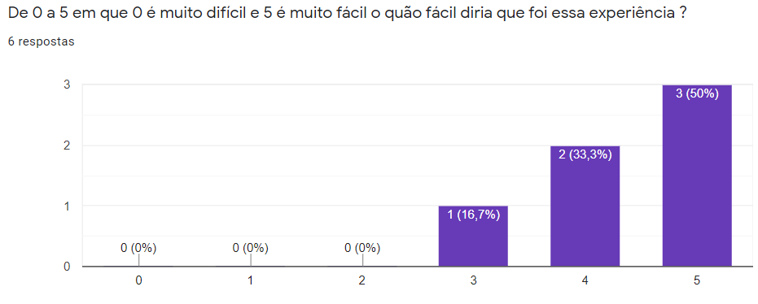
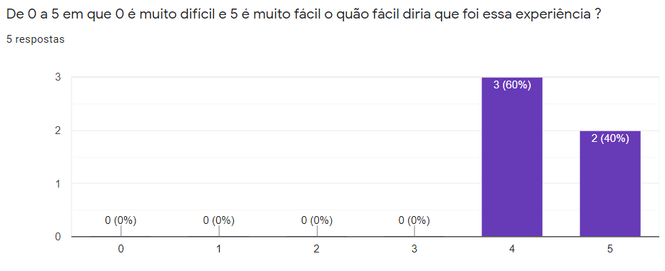
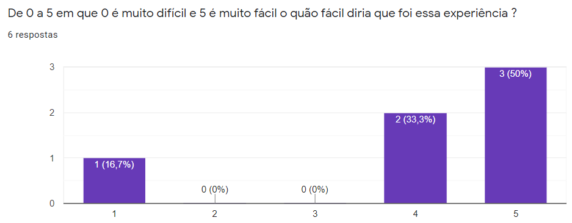

# Teste de Aceitação

Ao todo foram utilizadas duas verões de testes de aceitação para coletar *feedback* dos usuários. Os testes de aceitação foram coletados por meio de formulários que foram feitos com base nos requisitos levantados e documentados através de [Histórias de usuário](https://fga-eps-mds.github.io/2021.1-Cartografia-social-docs/docs/product-backlog.html#lista-das-historias-de-usuario) e são guiado pelas [Jornadas do usuário](https://fga-eps-mds.github.io/2021.1-Cartografia-social-docs/lean/lean-inception.html#atividade-6-jornada-do-usuario).

## Primeira versão

* [Visualização do Formulário](https://docs.google.com/forms/d/e/1FAIpQLSf-eOBgft13aVssk47MmAuuORsmUYlDBpfE3j2TCN26nnfRrw/viewform)

* Respostas coletadas [link](https://docs.google.com/spreadsheets/d/e/2PACX-1vRztNr26kiQbVlwMy_2dC4sCMgeo1gC8KJaQNFHdIfG_k6EvJ1F0NkbwlDRGJ1pU5INz7TPIcK3-pcW/pubhtml):

<iframe style="width: 0; min-width: 100% !important;" src="https://docs.google.com/spreadsheets/d/e/2PACX-1vRztNr26kiQbVlwMy_2dC4sCMgeo1gC8KJaQNFHdIfG_k6EvJ1F0NkbwlDRGJ1pU5INz7TPIcK3-pcW/pubhtml?widget=true&amp;headers=false"></iframe>

Alguns destaques das respostas:

* Adicionar um ponto com nome e descrição:

* Gravar um áudio:

* Escutar um áudio:

## Segunda versao

* [Visualização do Formulário](https://docs.google.com/forms/d/e/1FAIpQLSfFk_FQ0-2sh9mTAQOdwWmtLuns1vJSX7kx8kGL9hiVwykuJg/viewform)

* Respostas coletadas [link](https://docs.google.com/spreadsheets/d/e/2PACX-1vSk11bIQB7cNCWEoFpexdz8p9t9-V5_REQgBne9VwSiLiglHNvXSYDqAFC5YC7oFGUmg3uwzLYwilCU/pubhtml):

<iframe style="width: 0; min-width: 100% !important;" src="https://docs.google.com/spreadsheets/d/e/2PACX-1vSk11bIQB7cNCWEoFpexdz8p9t9-V5_REQgBne9VwSiLiglHNvXSYDqAFC5YC7oFGUmg3uwzLYwilCU/pubhtml?widget=true&amp;headers=false"></iframe>

Este formulário considera os seguintes dados:
- [Histórias de usuário](https://fga-eps-mds.github.io/2021.1-Cartografia-social-docs/docs/product-backlog.html#lista-das-historias-de-usuario) implementadas ou parcialmente implementadas: 01, 02, 05, 07, 10, 11, 12, 13, 14, 15, 19, 21, 22, 24, 26, 27, 30, 31, 35, 36, 37
- [Histórias de usuário](https://fga-eps-mds.github.io/2021.1-Cartografia-social-docs/docs/product-backlog.html#lista-das-historias-de-usuario) não implementadas: 03, 04, 06, 08, 09, 16, 17, 18, 20, 23, 25, 28, 29, 32, 33, 34, 38

## Versionamento de edições desta página

| Data       | Autor         | Descrição            | Versão |
| ---------- | ------------- | -------------------- | ------ |
| 06/11/2021 | Guilherme Guy | Criação do documento | 1.0    |
