# Lean Inception
A Lean Inception é um método cridao por Paulo Caroli para que a equipe de desenvolvimento, em uma semana, obtenha o produto mínimo viável (MVP), que por sua vez, significa obter a versão mais simples de um produto que pode ser lançada com uma quantidade mínima de esforço e desenvolvimento.  
Uma Lean Inception é um workshop coletivo que visa alinhar o entendimento das áreas de negócio e técnicas sobre um produto em seus aspectos mais fundamentais. Ela acontece bem no começo de projetos, quando tanto as áreas de negócio quanto as áreas técnicas ainda têm apenas um esboço de produto em mente: quem serão seus usuários e sua jornada até o produto, quais serão as funcionalidades do produto ou o escopo e agenda das entregas.    
Portanto este documento tem por finalidade mostrar o que foi feito, pelo time, durante a Lean Inception.

## Atividade 1: Visão do produto
Esta atividade tem por objetivo nortear todas as decisões em relação ao produto com base no entendimento dos objetivos do dono do produto e os problemas e necessidades do usuário do produto.  

Para a realização dessa tarefa, o nosso time se dividiu em 3 grupos, onde cada grupo iria fazer sua própria visão respondendo determinadas questões definidas anteriormente. Logo após o time se reuniu por completo para discutir e juntar as principais idéias para formar a visão de produto geral.  
Abaixo segue o que foi desenvolvido por cada grupo e também a visão de produto geral definida após a discussão.
### Grupo 1
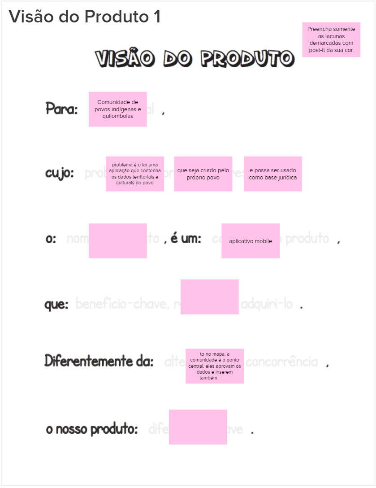
### Grupo 2
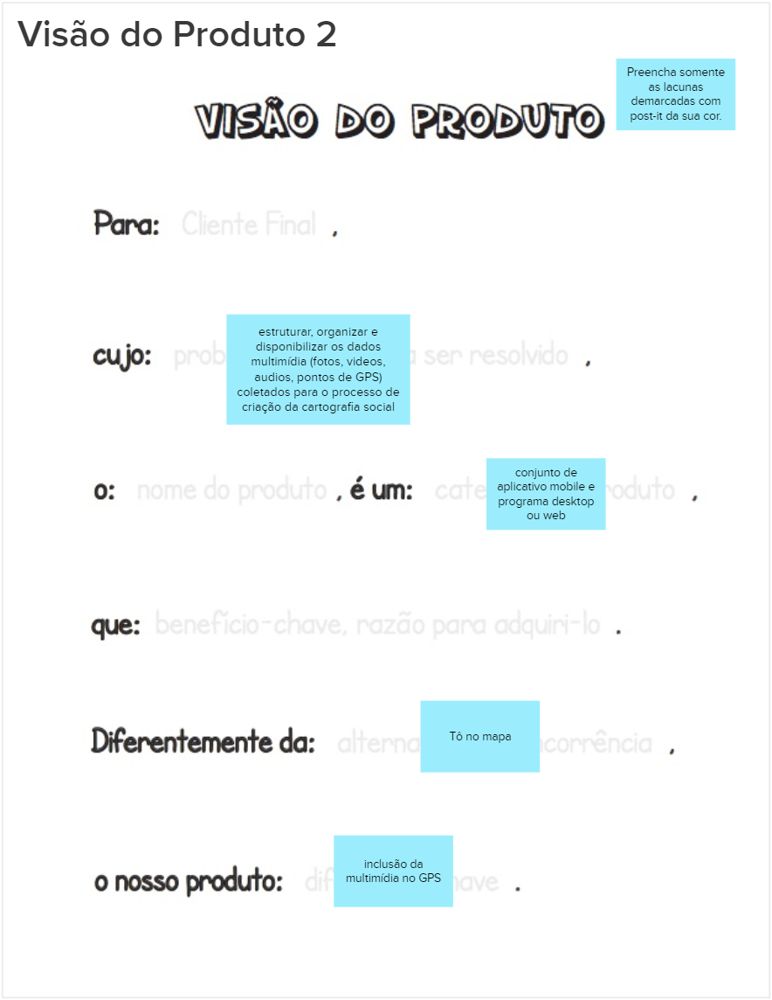
### Grupo 3
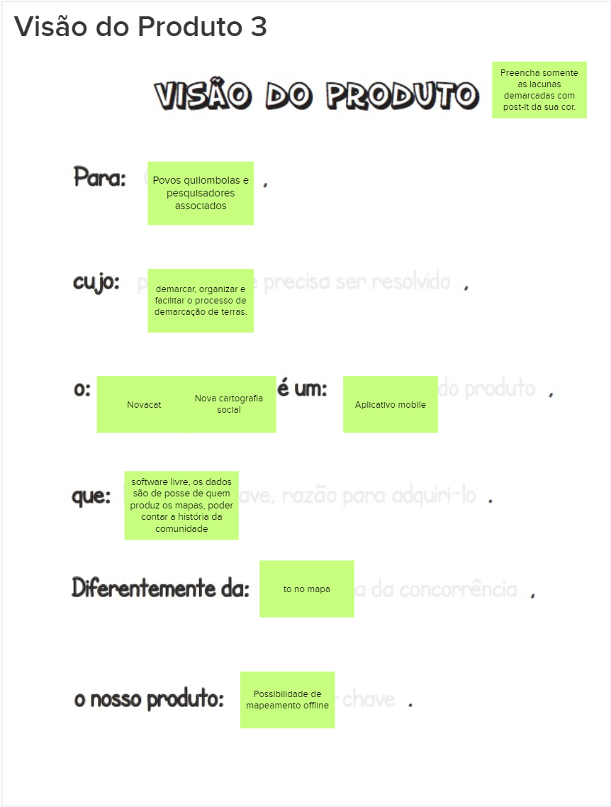
### Geral
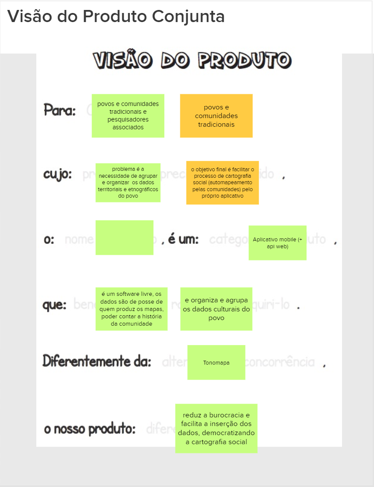

## Atividade 2: O produto É - NÃO É - FAZ - NÃO FAZ
Esta atividade ajuda a definir o produto de forma que, por vezes é mais fácil descrever algo pelo que tal coisa não é ou deixa de fazer. É perceptivel que depois dessa atividade os participantes passam a ter uma visão mais alinhada tanto sobre o que o produto faz, tanto quanto o que o produto não faz.  

Para a realização dessa tarefa, foi definido um tempo para que todos que estavam presentes pudessem colocar, pelo menos, uma idéia do que o produto é, do que o produto não é, do que o produto faz e do que o produto não faz. Ao final do tempo o grupo se juntou em uma discussão para ver se o que foi colocado fazia sentido e corrigir possiveis idéias que estavam desalinhada com o escopo.  
No fim foi gerado a tabela abaixo contendo os itens após a discussão.

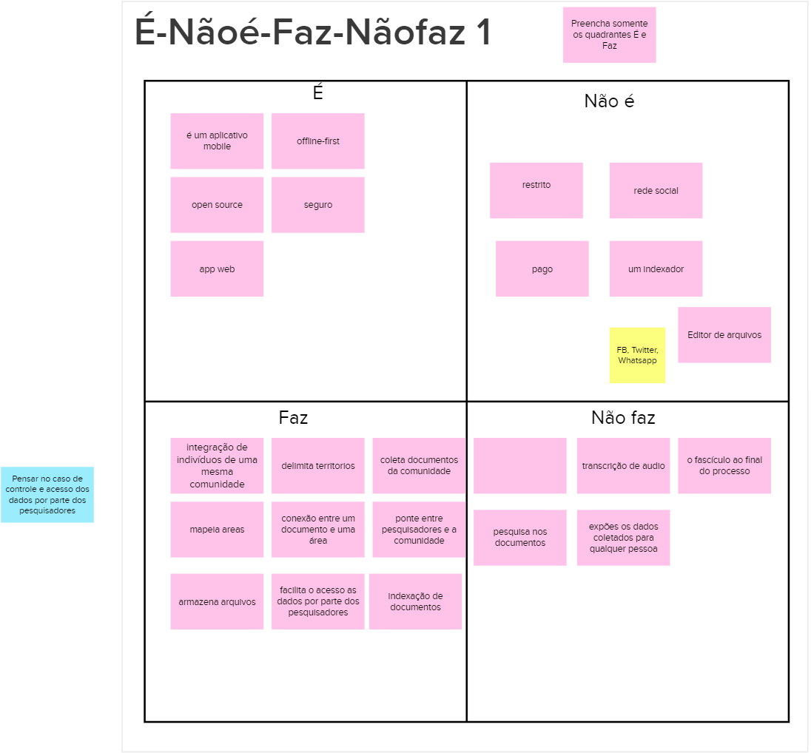

## Atividade 3: Objetivos do negócio
Esta atividade serve para auxiliar no levantamento e esclarecimento dos objetivos do produto.

Para a realização dessa tarefa, foi definido um tempo para que todos que estavam presentes pudessem colocar idéias do que pensavam ser os objetivos do produto. Ao final do tempo o grupo se juntou em discussão para agrupar, em clusters, as idéias que tinham similaridade e para remover as duplicadas, além de abrir uma votação para definir qual dos objetivos seria o mais importante de cada cluster.

A tabela abaixo representa esta discussão, onde os cards rosas são os clusters e as bolinhas em cima de alguns cards representam o numero de votos. O card Icebox serve para funcionalidades que foram levantadas mas ficarão "congeladas" no escopo.
 
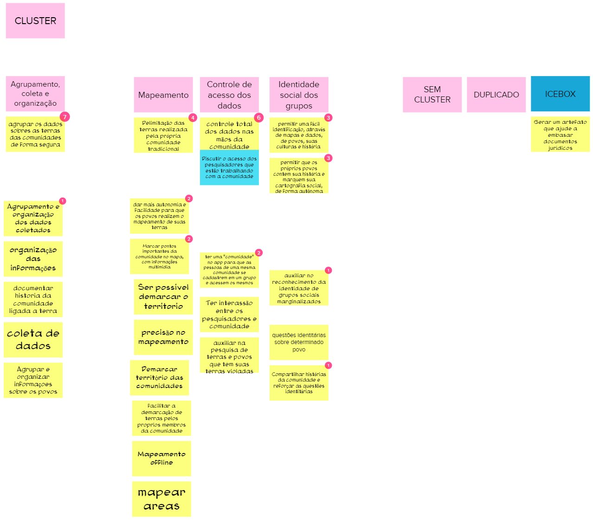

## Atividade 4: Personas
Esta atividade serve para representar um usuário do sistema, descrevendo o seu papel e suas necessidades específicas, identificando, assim, as funcionalidades do sistema. Para isso são criadas representações realísticas de usuários, auxiliando o time a descrever funcionalidades do ponto de vista de quem irá interagir com o produto final, estas representações são chamadas de personas.

Para a realização dessa tarefa, o nosso time se dividiu em 3 grupos, onde cada grupo pensou em uma persona com funções diferentes dentro da aplicação, para servir de auxilio no levantamento de requisitos posteriormente. O resultado se encontra nas tabelas abaixo.
### Grupo 1
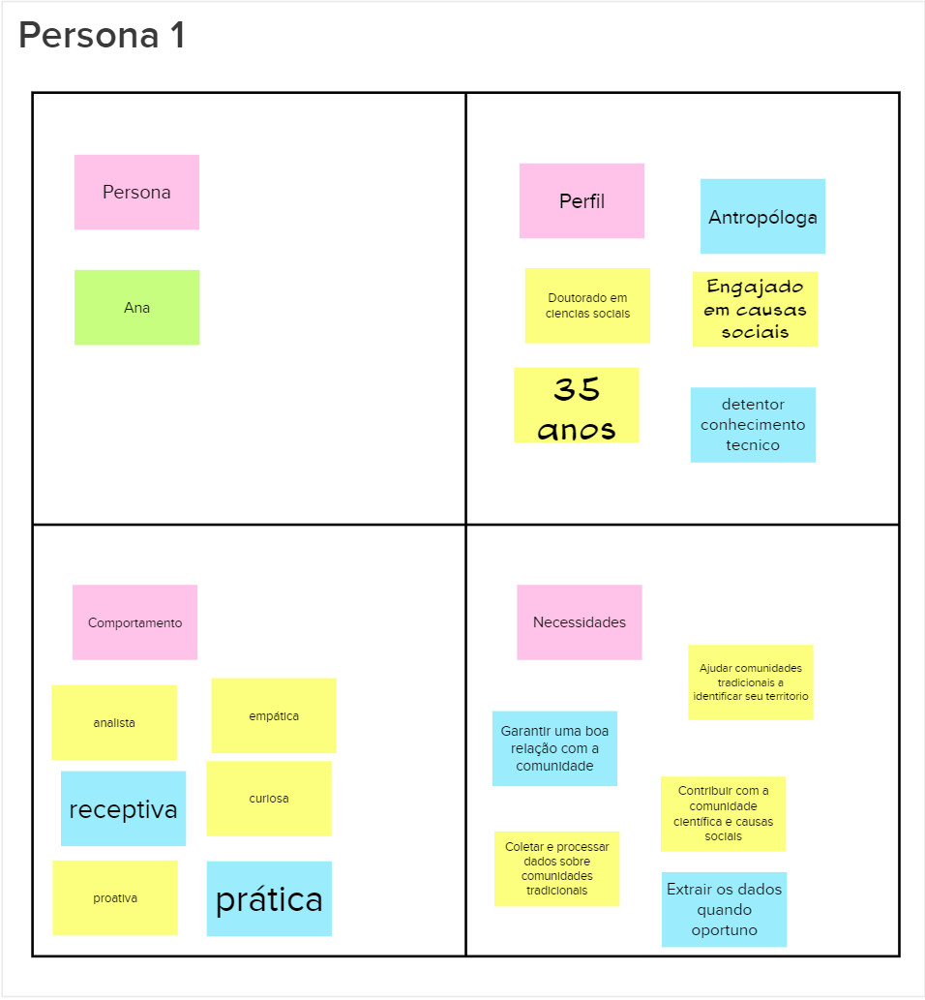
### Grupo 2
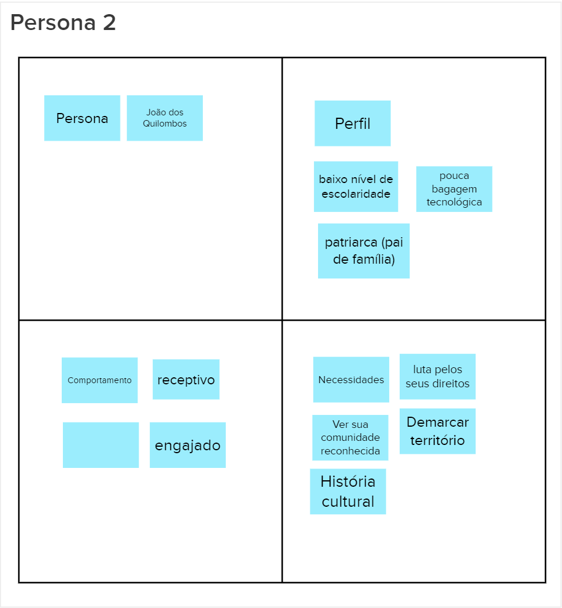
### Grupo 3
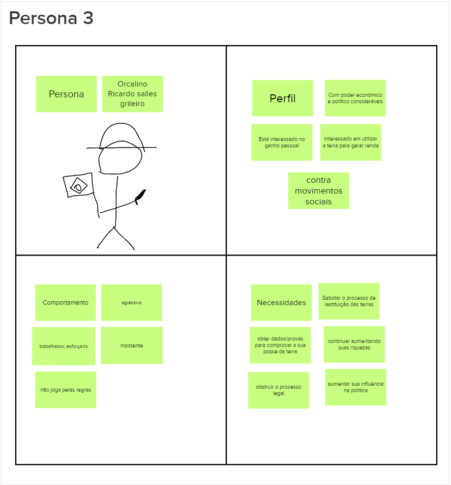

## Atividade 5: Brainstorming de funcionalidades
Esta atividade é uma técnica utilizada para propor soluções a um problema específico. Consiste em uma reunião também chamada de tempestade de ideias, na qual os participantes devem ter liberdade de expor suas sugestões e debater sobre as contribuições dos colegas. No âmbito de software o brainstorming serve para que os participantes deem idéias de funconalidades do produto.

Para a realização dessa tarefa, foi definido um tempo para que todos que estavam presentes pudessem colocar idéias de funcionalidades da aplicação. Ao final do tempo o grupo se juntou em discussão para agrupar as idéias que tinham similaridade e para remover as duplicadas.

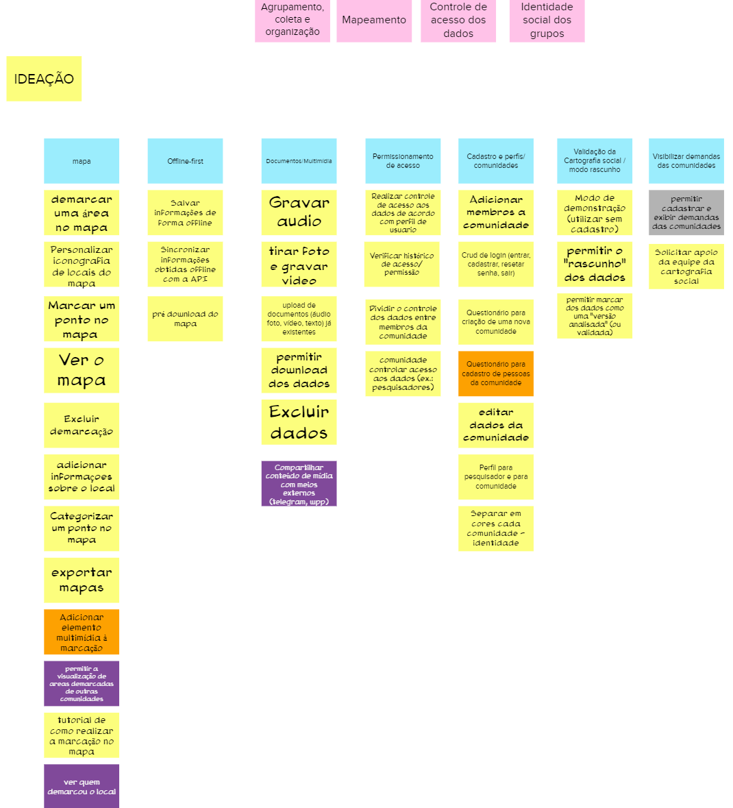

## Atividade 6: Jornada do usuário
Esta atividade serve para compreender todas as fases de interação que o cliente final tem com um produto quando se dejesa cumprir uma determinada atividade. Ou seja, realiza-se o mapeamento detalhado de todo contato e experiência possível que o usuário poderá ter durante a utilização do que está sendo proposto.

Para a realização dessa tarefa, o nosso time se dividiu nos mesmos 3 grupos que desenvolveu as personas e cada grupo ficou responsável por sua respectiva persona. A idéia aqui era que cada persona tivesse um objetivo a ser cumprido dentro do produto (card verde) e o grupo teria que pensar como seria o fluxo dentro da aplicação que esse usuário seguiria para cumprir esse objetivo (card rosa). Depois foi definido um tempo para que o grupo colocasse todas funcionalidades, que foram levantadas no brainstorming, que tivesse a ver com aquele fluxo de trabalho (card amarelo). O resultado se encontra nas tabelas abaixo. 
### Grupo 1
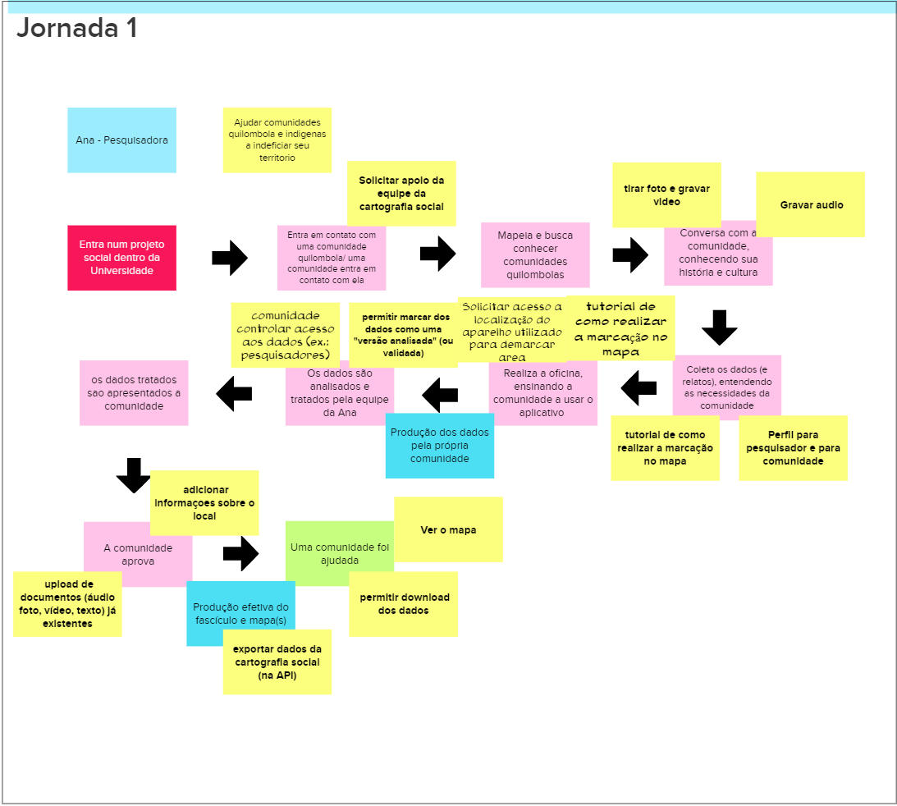
### Grupo 2
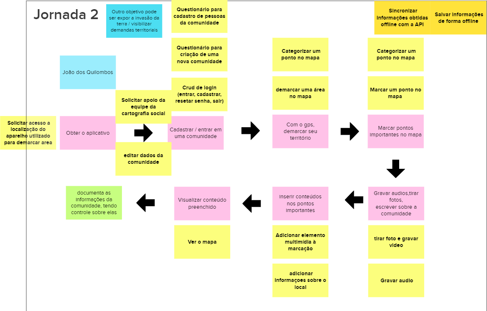
### Grupo 3
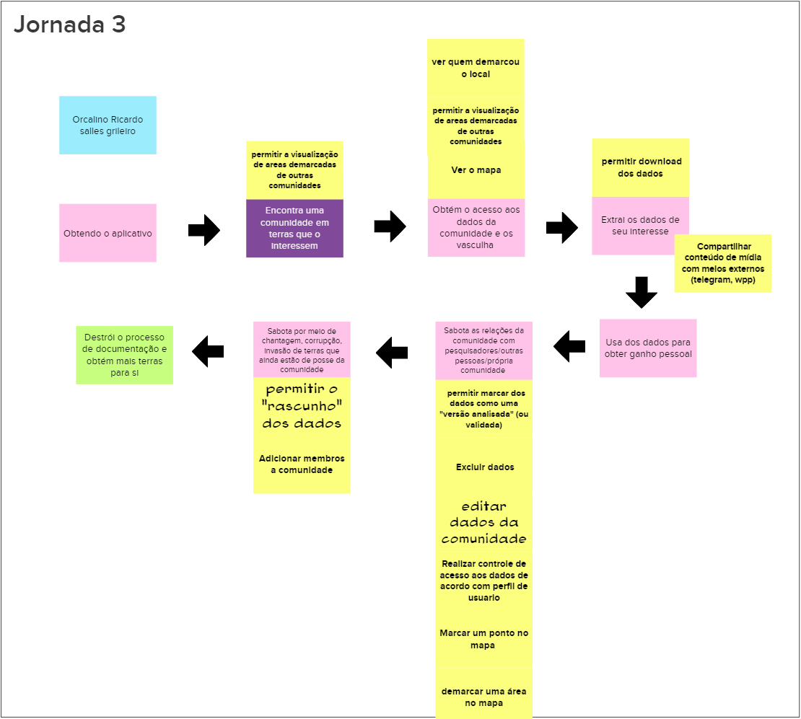

## Atividade 7: Revisão técnica, de negócio e de UX
Nesta atividade os participantes representam as funcionalidades do produto com suas cores e marcações indicando nível de incerteza, esforço e percepção de valor para o negócio e para os usuários, para que assim fique mais fácil de priorizar posteriormente. A marcação de cada funcionalidade é dada a partir de um mapa de 2 eixos, onde o eixo y representa qual a clareza daquela funcionalidade no ponto de vista de négocios e o eixo x representa o congecimento de como fazer aquela funcionalidade no ponto de vista de desenvolvimento.

Segue o mapa abaixo:  

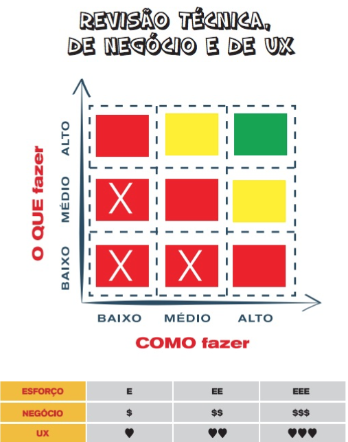

Para a realização dessa tarefa, o grupo se reuniu em discussão em forma de uma mesa redonda, onde o lider lia a funcionalidade e um membro falava qual a classificação que aquela funcionalidade tinha e ai o time dizia se concordava ou não, dando seu ponto de vista. Depois de ter todas funcionalidades classificadas com as respectivas cores, o time classificou cada uma de acordo com o valor de esforço, négocio e UX. O resultado dessa classificação se encontra na imagem abaixo.

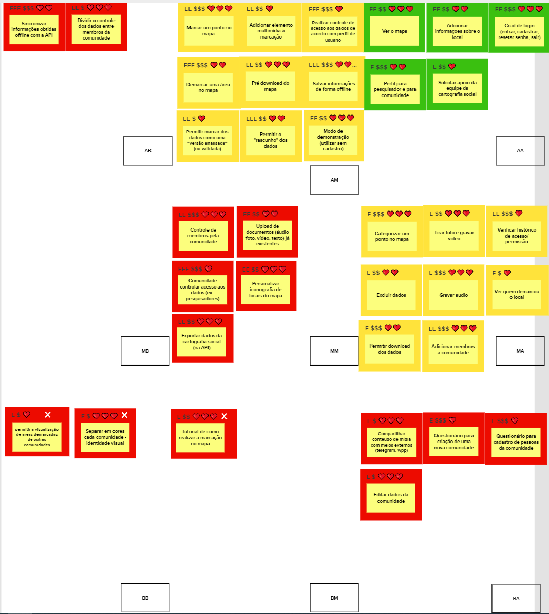

## Atividade 8: Sequenciador
O sequenciador é uma ferramenta visual, de fácil entendimento e bastante eficaz para que as pessoas compreendam, organizem e priorizem melhor os seus itens de trabalho, ele auxilia na organização e visualização das funcionalidades e da sequência de validação incremental do produto.
O intuito dessa atividade é executar o que é mais impactante o mais cedo possível, logo nas primeiras ondas. E seguir trabalhando nos itens de trabalho do sequenciador, de onda em onda. Mas para isso acontecer algumas regras tem que ser cumpridas:
* Regra 1: Uma onda pode conter, no máximo, três cartões.
* Regra 2: Uma onda não pode conter mais de um cartão vermelho.
* Regra 3: Uma onda não pode conter três cartões amarelos e vermelhos.
* Regra 4: A soma de esforço dos cartões não pode ultrapassar cinco Es.
* Regra 5: A soma de valor dos cartões de uma onda não pode ser menos de quatro $s e quatro corações.
* Regra 6: Se um cartão depende de outro cartão, esse outro deve estar em alguma onda anterior.

Para a realização dessa tarefa, o time se reuniu em discussão para fazer a montagem das ondas de acordo com as regras.

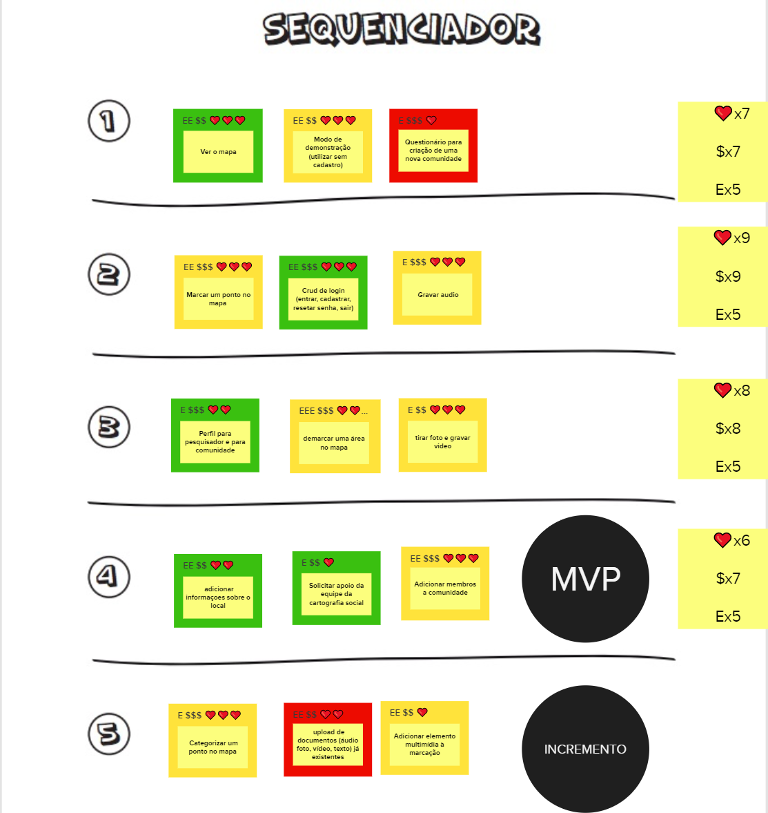

## Atividade 9: MVP canvas
O MVP é a versão mais básica pela qual um produto pode ser utilizado pelos seus usuários. Ele tem as features fundamentais, o core do produto, bem menos desenvolvido do que sua versão completa. 

Para a definição do produto mínimo viável
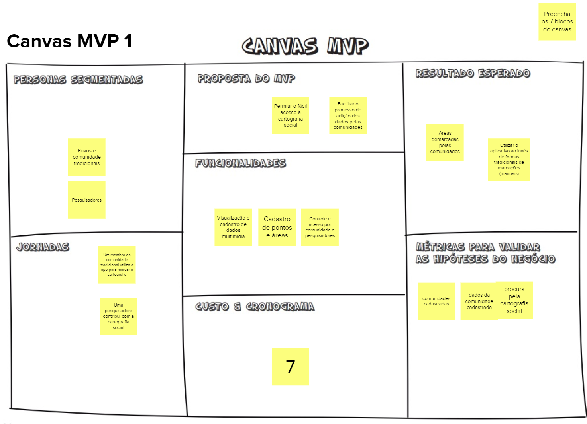

## Referências:

* O que é Lean Inception?. **Supero**, 23 de jun. de 2020. Disponível em: <https://www.supero.com.br/blog/o-que-e-lean-inception/>. Acesso em: 05 de set. de 2021.
* O que é e como criar a visão e a estratégia do produto?. **Gyaco**, 03 de dez. de 2016. Disponível em: <http://www.gyaco.com/2016/03/visao-e-estrategia-do-produto/>
* É – Não é – Faz – Não faz. **Caroli**, 30 de jan. de 2015. Disponível em: <https://www.caroli.org/e-nao-e-faz-nao-faz/>
* Brainstorming: O Que É, Como Fazer (Passo a Passo). **Neilpatel**. Disponível em: <https://neilpatel.com/br/blog/o-que-e-brainstorming/>
* O que é a jornada do usuário e qual sua importância em UX?. **escoladesignthinking**, 25 de set. de 2020. Disponível em: <https://escoladesignthinking.echos.cc/blog/2020/09/jornada-do-usuario-ux/>
* Lean Inception e o ‘As Is / To Be’. **Caroli**, 06 de mar. de 2018. Disponível em: <https://www.caroli.org/lean-inception-as-is-to-be/>
* [Sequenciador] Como Ordenar e Priorizar. **Caroli**, 25 de dez. de 2018. Disponível em: <https://www.caroli.org/sequenciador/>

***
## Versionamento de edições desta página
---

| Data | Autor | Descrição | Versão |
|------|-------|-----------|--------|
| 05/09/2021 | Marco Antônio | Criação da página e adição de conteúdo | 1.0 |